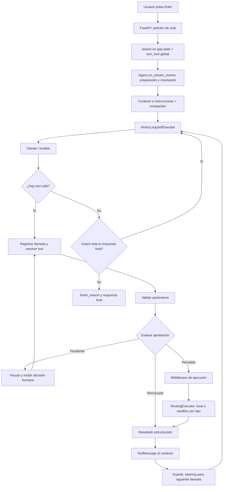
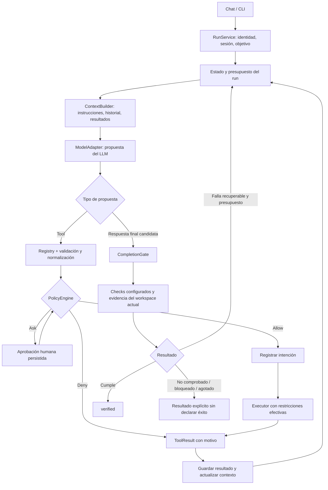

# MaxAI: del loop controlado a la finalización verificable

## Dictamen

**MaxAI ya es un harness.** El LLM propone acciones y respuestas; código externo construye su contexto, resuelve tools, valida parámetros, gestiona aprobaciones y ejecuta acciones. Que el modelo elija la siguiente herramienta es compatible con un harness.

La debilidad principal observada es distinta: **el control de ejecución está más desarrollado que el control de éxito**. El runtime puede ejecutar correctamente una herramienta y aun así terminar una tarea que no cumple sus requisitos. Un harness sólido deja al modelo elegir estrategias, pero conserva autoridad sobre permisos, presupuestos, transiciones de estado y criterios de aceptación.

Etiquetas: **VERIFIED** = visible en el código citado; **INFERRED** = conclusión del análisis; **PROPOSED** = diseño por implementar; **UNKNOWN** = no establecido. Esta revisión no certifica seguridad ni supone que se hayan auditado todos los módulos o configuraciones.

## 1. Flujo actual

**VERIFIED:** `max_ai/reasoning/react_self_directed.py:214` controla el límite de iteraciones; `:319` procesa finales; `max_ai/base/tool_executor.py:290` resuelve tools y `:303` valida antes de evaluar aprobación. Errores, cancelación y pausas tienen caminos adicionales; el diagrama resume el camino central.

## 2. Quién decide hoy

| Decisión | Autoridad observada | Evaluación |
|---|---|---|
| Qué investigar o editar | LLM dentro del loop | Normal en un agente; no necesita convertirse en workflow rígido |
| Nombre y argumentos propuestos | LLM | Deben tratarse como entrada no confiable |
| Si existe la tool y sus parámetros son válidos | ToolExecutor / tool | VERIFIED: control externo al modelo |
| Si una tool requiere aprobación | Configuración de tool y estado del record | VERIFIED: gate real, no mera instrucción textual |
| Dónde ejecutar | RoutingExecutor | VERIFIED: el tipo CoreRuntimeTool determina sandbox |
| Cuándo termina el presupuesto de iteraciones | Loop | VERIFIED: límite efectivo |
| Cómo reaccionar a repetición o esquema incorrecto | Guard detecta; LLM decide cómo corregirse | VERIFIED: steering, no garantía de corrección |
| Si terminar una respuesta sin tools | Modelo propone; guards pueden vetar | VERIFIED: existe control, pero acotado |
| Si la tarea cumple requisitos | No se identificó un contrato independiente en el camino revisado | INFERRED: brecha de verificación |

## 3. Hallazgos priorizados

### P1 — Finalizar conversación no equivale a completar tarea

**VERIFIED:** en `react_self_directed.py:323`, una respuesta sin tools termina cuando ningún guard la veta. `guards.py`, `PlanCompletionGuard`, limita sus nudges y permite detenerse al alcanzar ese límite. También acepta pasos en estado `done` o `failed` como no pendientes.

**INFERRED:** el estado del plan y el texto del modelo no prueban éxito. Un plan con pasos fallidos puede dejar de bloquear el final sin que eso sea un éxito de tarea.

**PROPOSED:** separar `response_finished` de `task_outcome`. Usar resultados `verified`, `failed`, `blocked`, `unverified`, `cancelled`, `budget_exhausted`; reservar `verified` para checks satisfechos. Para una consulta conversacional puede no haber checks de ejecución: no exigir tests artificiales a toda respuesta.

**Criterio de aceptación:** si una tarea exige un test y este falla, el modelo no puede convertir el resultado en `verified` mediante texto o `update_plan`.

### P1 — Guards orientan; no sustituyen invariantes

**VERIFIED:** `guards.py` devuelve texto; `react_self_directed.py:559` aplica los hooks y omite guards que lanzan excepciones. RepetitionGuard avisa después de la ronda. BudgetGuard avisa, mientras el loop aplica el límite de iteraciones.

**PROPOSED:** conservar steering para recuperación y separar checks obligatorios con resultados tipados. Una política de seguridad que falla no debe ejecutarse como guard best-effort. Los límites duros se evalúan antes de nuevas acciones costosas.

**Criterio de aceptación:** una tool que excede una cuota obligatoria queda bloqueada aunque el modelo ignore el mensaje de advertencia.

### P1 — Política de capacidades más precisa

**VERIFIED:** `tool_executor.py:398` evalúa aprobación por configuración de tool y record. `executor/routing.py` envía CoreRuntimeTool al sandbox y las demás tools al ejecutor local.

**INFERRED:** confiar en el código de una tool no implica que todos los argumentos elegidos por el modelo sean autorizados. El tipo de clase es una regla de routing útil, pero no expresa por sí solo permisos por ruta, identidad o destino de red. No se ha demostrado una vulnerabilidad explotable en esta revisión.

**PROPOSED:** después de validar y normalizar argumentos, evaluar una política común con identidad, workspace, capacidades y efectos. Devolver `allow`, `deny` o `ask` con motivo. Vincular la aprobación a la llamada normalizada y a su alcance; comprobar nuevamente el alcance al ejecutar. Los adaptadores deben aplicar las restricciones efectivas.

**Criterio de aceptación:** una tool local y una tool de shell no pueden eludir el mismo límite de workspace simplemente por usar ejecutores distintos.

### P1 — Persistencia opcional no garantiza recuperación

**VERIFIED:** `base/agent.py:1248` implementa checkpoint best-effort y omite guardar sin store. `ui/server.py:160` mantiene sesiones en memoria.

**INFERRED:** persistir al final de una ronda deja un intervalo entre un efecto externo y su checkpoint. Un reinicio puede dejar incierto si ocurrió la acción. Eso requiere una estrategia de recuperación; no se resuelve prometiendo ejecución exactamente una vez.

**PROPOSED:** registrar intención antes de la acción y resultado después; recuperar llamadas interrumpidas como `unknown_outcome` hasta reconciliarlas. Reintentar automáticamente solo acciones seguras o idempotentes. Persistir aprobaciones pendientes antes de mostrarlas cuando se requiera recuperación tras reinicio.

**Criterio de aceptación:** reiniciar después de un efecto externo no vuelve a ejecutarlo ciegamente.

### P2 — Concurrencia ligada a la UI

**VERIFIED:** `ui/server.py:163` crea un lock global usado en los caminos de ejecución (`:421`, `:487`).

**INFERRED:** limita el paralelismo entre sesiones. Cambiarlo sin revisar el estado mutable compartido del Agent y los ejecutores puede introducir carreras.

**PROPOSED:** primero definir aislamiento por run y qué recursos son compartidos; después introducir locks por sesión y leases/versiones si hay múltiples procesos. Mantener las mutaciones sobre el mismo workspace coordinadas.

**Criterio de aceptación:** dos sesiones independientes progresan a la vez sin mezclar contexto, mientras dos acciones conflictivas sobre el mismo recurso se serializan.

## 4. Correcciones a la página 08

- “Approval and ask-user are durable record states” es demasiado fuerte: son estados explícitos; la durabilidad depende del store y de guardados exitosos.
- La página describe guards, pero no explica suficientemente que su mecanismo principal es steering y que el veto puede agotarse.
- Añadir un verifier es una propuesta para tareas con criterios comprobables, no evidencia de que hoy exista uno ni requisito de ejecutar tests para toda conversación.
- La existencia de Docker no prueba aislamiento universal: RoutingExecutor conserva tools locales y las garantías dependen de configuración, mounts y políticas. La seguridad integral del sandbox queda **UNKNOWN** en esta revisión.
- Un event log puede ayudar a recuperación y auditoría; no hace falta adoptar event sourcing completo para corregir el primer problema de finalización.

## 5. Arquitectura objetivo — PROPOSED

El LLM mantiene libertad para investigar y editar. El harness posee el estado y decide si una acción está autorizada y si la evidencia permite declarar éxito. La verificación puede ocurrir después de una edición relevante o ante una finalización candidata; no tiene por qué ejecutar toda la suite después de cada lectura.

## 6. Contratos mínimos a introducir

| Contrato propuesto | Responsabilidad | Dónde conectarlo |
|---|---|---|
| TaskSpec | Objetivo, alcance y criterios acordados; el modelo puede proponerlos pero no debilitarlos unilateralmente | Entrada del run |
| PolicyDecision | allow/ask/deny, motivo y alcance | ToolExecutor tras validación y antes de ejecución |
| VerificationResult | Check, estado, comando/salida, revisión del workspace y fecha | Checks configurados por aplicación/proyecto |
| CompletionDecision | Complete / continue / blocked / failed / unverified | Todas las salidas terminales del loop |
| RunBudget | Iteraciones, tiempo y límites de coste configurados | Antes de llamadas de modelo y tools |
| ExecutionRecord | Intención, intento, resultado y recuperación | Alrededor del efecto externo |

La evidencia debe invalidarse si cambian los archivos relevantes después de comprobarlos. Un exit code cero solo acredita el check ejecutado, no toda la intención del usuario. Las comprobaciones arbitrarias propuestas por el LLM también requieren autorización para ejecutarse.

## 7. Plan incremental

1. **CompletionGate y outcome tipado.** Incorporar un verificador configurable sin cambiar el mecanismo de tools. Cubrir finales sin tools, finalización por plan, presupuesto y cancelación. Mantener compatibilidad para tareas sin criterios configurados, reportándolas sin éxito verificado.
2. **Política común.** Aprovechar el gate de aprobación existente y añadir alcance por capacidad; no duplicar approvals dentro de los guards.
3. **Recuperación explícita.** Persistencia obligatoria para runs recuperables, intención/resultado y tratamiento de outcomes inciertos.
4. **Separar RunService de transporte.** UI y CLI consumen el mismo runtime; revisar estado compartido antes de habilitar concurrencia por sesión.
5. **Contexto y observabilidad.** Añadir procedencia, truncamiento y evidencia por llamada, junto con eventos de política y verificación.

Pruebas significativas para esa implementación futura: final prematuro con check fallido; evidencia obsoleta tras editar; agotamiento de presupuesto sin éxito; rechazo de acción antes de efecto; reinicio entre ejecución y checkpoint; aislamiento de sesiones. Esta evaluación no ejecuta esas pruebas porque todavía no implementa esos contratos.

## Conclusión

No hace falta reemplazar MaxAI por un workflow rígido ni empezar de cero. Hay que conservar el loop, las tools, aprobaciones y ejecutores, y reforzar tres fronteras: **qué puede ejecutarse, qué ocurrió realmente y qué permite declarar la tarea completada**. La primera modificación recomendada es un CompletionGate con resultados verificables y estados terminales honestos.
