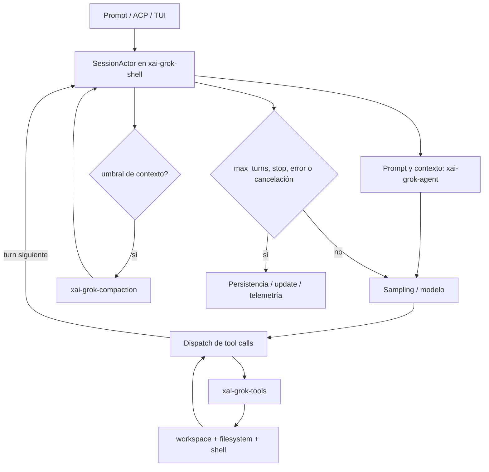
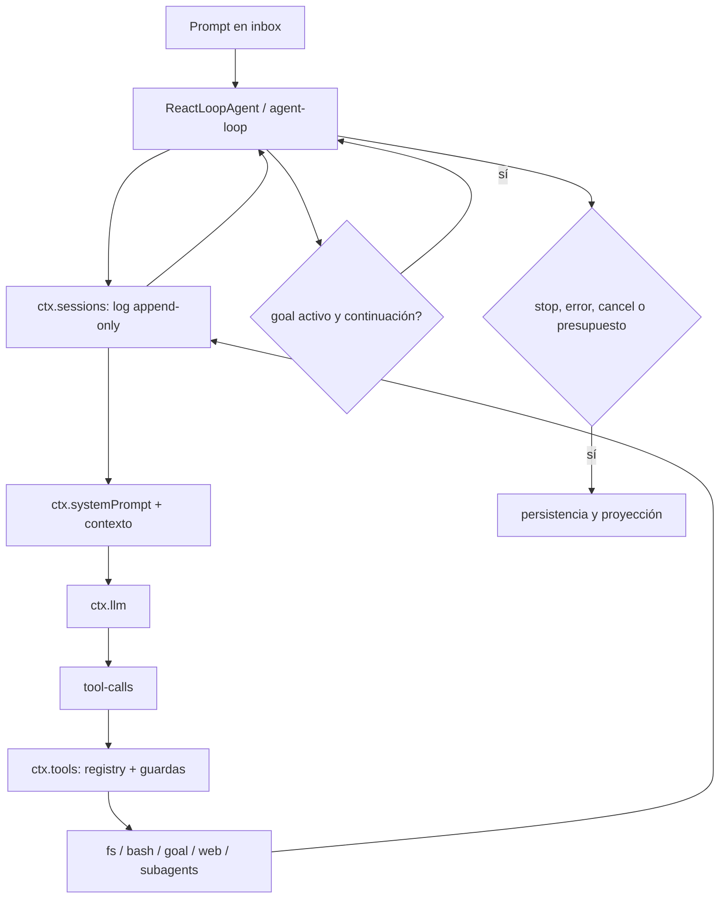
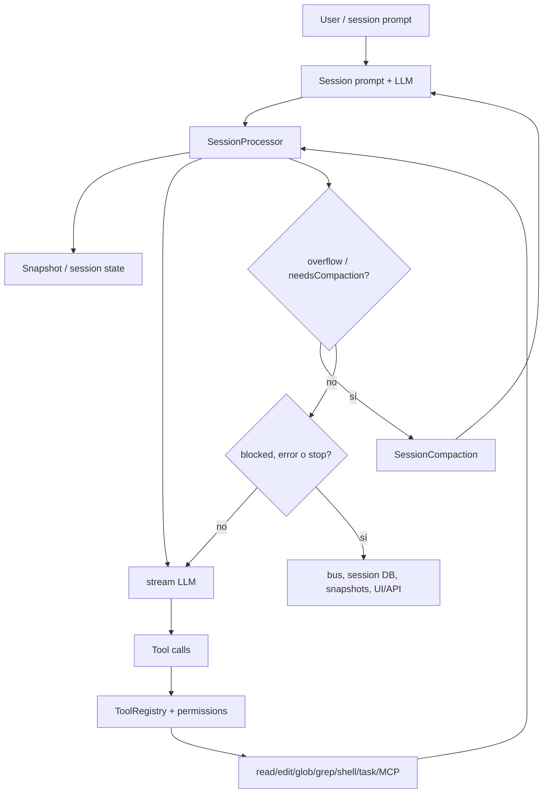

# Componentes de harness verificados: Grok Build, DeepSeek Harness y OpenCode

Fecha de consulta: 2026-09-11. Alcance: lectura de los repositorios fuente oficiales y de su documentación versionada; no se modificó ni ejecutó ninguno de los runtimes.

## Verificación de repositorios

| Sistema | Repositorio oficial | Estado verificado | Rama consultada |
|---|---|---|---|
| Grok Build | [xai-org/grok-build](https://github.com/xai-org/grok-build) | Existe, público, Rust; contiene CLI/TUI y runtime | `main` |
| DeepSeek Harness | [deepseek-ai/deepseek-harness](https://github.com/deepseek-ai/deepseek-harness) | Existe, público; monorepo TypeScript/Cordis por paquetes | `master` |
| OpenCode | [anomalyco/opencode](https://github.com/anomalyco/opencode) | Existe, público; monorepo TypeScript | `dev` |

La fecha y las ramas importan: son árboles vivos. Los enlaces de abajo apuntan a ramas, salvo donde se indique un archivo concreto; para una comparación reproducible conviene fijar después un commit SHA.

## 1. Grok Build

### Arquitectura y cableado

La división funcional visible en el árbol es: `xai-grok-shell` como runtime de sesión, `xai-grok-agent` para prompt/políticas del agente, `xai-grok-tools` para registro y ejecución de herramientas, `xai-grok-workspace` para cwd/worktrees/permisos y `xai-grok-compaction` como motor compartido. Esto está verificado en los directorios fuente de [shell](https://github.com/xai-org/grok-build/tree/main/crates/codegen/xai-grok-shell/src), [agent](https://github.com/xai-org/grok-build/tree/main/crates/codegen/xai-grok-agent/src), [tools](https://github.com/xai-org/grok-build/tree/main/crates/codegen/xai-grok-tools/src), [workspace](https://github.com/xai-org/grok-build/tree/main/crates/codegen/xai-grok-workspace/src) y [compaction](https://github.com/xai-org/grok-build/tree/main/crates/common/xai-grok-compaction/src).

El flujo operativo es un actor de sesión que recibe el prompt, construye el contexto, llama al modelo, despacha llamadas a herramientas y continúa hasta una condición de parada. El estado de sesión expone `max_turns`, interjecciones, compaction, memoria y telemetría en [`acp_session.rs`](https://github.com/xai-org/grok-build/blob/main/crates/codegen/xai-grok-shell/src/session/acp_session.rs). La forma exacta de la selección principal del actor está distribuida entre `session/` y `session/acp_session_impl/`; el repositorio no ofrece una página única equivalente a un diagrama de loop.

### Contexto y compaction

**Código verificado.** La política está en [`xai-grok-agent/src/compaction.rs`](https://github.com/xai-org/grok-build/blob/main/crates/codegen/xai-grok-agent/src/compaction.rs): umbral porcentual, modelo de resumen, `memory_flush_enabled`, presupuesto temporal y opción de dos pasadas. El estado y los gates del actor están en [`session/compaction_config.rs`](https://github.com/xai-org/grok-build/blob/main/crates/codegen/xai-grok-shell/src/session/compaction_config.rs); el ensamblaje de la sesión en [`session/helpers/session_compact.rs`](https://github.com/xai-org/grok-build/blob/main/crates/codegen/xai-grok-shell/src/session/helpers/session_compact.rs). El motor desacoplado está en [`xai-grok-compaction/src/lib.rs`](https://github.com/xai-org/grok-build/blob/main/crates/common/xai-grok-compaction/src/lib.rs), con `intra_compaction`, `inter_compaction` y `code_compaction`.

**Docs verificados.** El README del runtime documenta auto-compaction al 85 %, `/compact`, `/context` y el modo de guardar contexto; [guía de comandos](https://github.com/xai-org/grok-build/blob/main/crates/codegen/xai-grok-pager/docs/user-guide/04-slash-commands.md) y [guía de sesiones](https://github.com/xai-org/grok-build/blob/main/crates/codegen/xai-grok-pager/docs/user-guide/17-sessions.md). La inferencia razonable es que el contexto visible se reemplaza por un resumen y una cola reciente; los detalles de qué eventos sobreviven deben leerse en `xai-grok-compaction` y no se deben deducir solo del README.

### Registro y dispatch de herramientas

**Código verificado.** El registro está en [`xai-grok-tools/src/registry`](https://github.com/xai-org/grok-build/tree/main/crates/codegen/xai-grok-tools/src/registry); las implementaciones se montan bajo [`src/implementations`](https://github.com/xai-org/grok-build/tree/main/crates/codegen/xai-grok-tools/src/implementations). El shell se implementa como la herramienta `run_terminal_cmd` en [`bash/mod.rs`](https://github.com/xai-org/grok-build/blob/main/crates/codegen/xai-grok-tools/src/implementations/grok_build/bash/mod.rs), con foreground/background, timeout y límites de salida. El README también enumera `read_file`, `search_replace`, `grep`, `list_dir`, `bash`, web, todo y subagentes, pero esa enumeración es documentación; la fuente de autoridad es el registro.

### Workspace, shell y sandbox

`xai-grok-workspace` contiene módulos de `file_system`, `permission`, `session` y `worktree` ([árbol fuente](https://github.com/xai-org/grok-build/tree/main/crates/codegen/xai-grok-workspace/src)). El agente puede leer y actuar sobre el workspace porque las herramientas reciben el cwd y resuelven paths a través de esa capa; el workspace también soporta worktrees y snapshots de sesión. El comando Bash obtiene `Cwd`, `Terminal`, entorno de sesión y el prefijo de archivos de salida desde el runtime, según [`bash/mod.rs`](https://github.com/xai-org/grok-build/blob/main/crates/codegen/xai-grok-tools/src/implementations/grok_build/bash/mod.rs).

El sandbox es una propiedad del proceso completo: el [manual oficial](https://github.com/xai-org/grok-build/blob/main/crates/codegen/xai-grok-pager/docs/user-guide/18-sandbox.md) documenta perfiles `off`, `workspace`, `read-only` y `strict`, Landlock en Linux y Seatbelt en macOS; la configuración se resuelve en la familia [`xai-grok-sandbox`](https://github.com/xai-org/grok-build/tree/main/crates/codegen/xai-grok-sandbox). El README afirma que Bash, grep, lectura, edición y subagentes heredan la restricción. Esto es evidencia documental y de módulos; no se hizo una prueba de enforcement aquí.

### Planificación y condiciones de parada

Grok tiene una ruta de objetivos/planificación integrada en el runtime: los templates `goal_*` están en [`session/templates`](https://github.com/xai-org/grok-build/tree/main/crates/codegen/xai-grok-shell/src/session/templates) y el estado de objetivo en [`goal_tracker.rs`](https://github.com/xai-org/grok-build/blob/main/crates/codegen/xai-grok-shell/src/session/goal_tracker.rs). La planificación ocurre cuando se activa el modo/flujo de goal y se inyectan reglas y herramientas específicas; no es evidencia de que todo prompt normal pase primero por un planificador separado. La parada está cableada por `max_turns`, estado de objetivo, cancelación, error, fin de tool-call y decisión del modelo; `max_turns` aparece explícitamente en [`acp_session.rs`](https://github.com/xai-org/grok-build/blob/main/crates/codegen/xai-grok-shell/src/session/acp_session.rs). El gate exacto de plan-mode y `exit_plan_mode` está bajo [`grok_build/exit_plan_mode`](https://github.com/xai-org/grok-build/tree/main/crates/codegen/xai-grok-tools/src/implementations/grok_build/exit_plan_mode).

### Estado, memoria y observabilidad

Las sesiones persisten bajo la infraestructura de `xai-grok-shell/src/session` y exponen resume/fork/rewind; la documentación describe `updates.jsonl`, snapshots por prompt y `/resume` en [17-sessions.md](https://github.com/xai-org/grok-build/blob/main/crates/codegen/xai-grok-pager/docs/user-guide/17-sessions.md). La memoria cross-session está documentada en el [README de shell](https://github.com/xai-org/grok-build/blob/main/crates/codegen/xai-grok-shell/README.md), con Markdown, índice SQLite, búsqueda híbrida, inyección en primer turno y flush antes de compaction; el prompt fuente define las rutas y reglas en [`agent/templates/prompt.md`](https://github.com/xai-org/grok-build/blob/main/crates/codegen/xai-grok-agent/templates/prompt.md). La telemetría y los logs están en [`xai-grok-telemetry`](https://github.com/xai-org/grok-build/tree/main/crates/common/xai-grok-telemetry) y el runtime contiene `session/export.rs`; el README advierte que las builds públicas no traen destinos de telemetría activos por defecto. No se verificó un único contrato público que cubra todos los eventos de observabilidad del actor; esa parte queda parcialmente distribuida.

## 2. DeepSeek Harness

### Arquitectura y cableado

DeepSeek es el caso más explícito de composición por capability seams. La documentación oficial describe seis piezas del spine: `session`, `system-prompt`, `tools`, `agent`, `agent-loop` y `scope`; [core.md](https://github.com/deepseek-ai/deepseek-harness/blob/master/docs/subsystems/core.md) afirma que cada paso deriva la request del log de sesión, ensambla prompt y schemas, llama al LLM, despacha tools y vuelve a escribir hechos visibles al modelo. El loop concreto es [`agent-loop/src/agent.ts`](https://github.com/deepseek-ai/deepseek-harness/blob/master/packages/core/agent-loop/src/agent.ts), que exporta el driver de turnos y steps.

### Contexto, compaction y dispatch

**Código y docs verificados.** `agent-loop/src/agent.ts` importa `assembleContextFor`, `joinContextSections`, `renderContextSections`, `renderPrompt`, `executeToolCalls` y el log de sesión. La herramienta registry está en [`packages/core/tools`](https://github.com/deepseek-ai/deepseek-harness/tree/master/packages/core/tools), con schema/presentation/ejecución scoped; la documentación describe registro, validación y pipeline guardado. Compaction es un capability opcional: [docs/subsystems/compaction.md](https://github.com/deepseek-ai/deepseek-harness/blob/master/docs/subsystems/compaction.md) y [compaction-basic](https://github.com/deepseek-ai/deepseek-harness/tree/master/packages/compaction/compaction-basic) definen el proveedor; el loop no queda conceptualmente atado a él. Por eso puede haber una composición mínima con compaction deshabilitada, como confirma el [Python SDK guide](https://github.com/deepseek-ai/deepseek-harness/blob/master/docs/user/guide/python-sdk.md).

### Workspace, shell y sandbox

La familia [`packages/workspace`](https://github.com/deepseek-ai/deepseek-harness/tree/master/packages/workspace) mantiene la entidad workspace y los registros durables de directorios/sesiones. El shell se separa en contrato [`shell`](https://github.com/deepseek-ai/deepseek-harness/tree/master/packages/shell/shell), implementaciones `bash-local`/`pwsh-local`, variantes `bash-sandbox`/`pwsh-sandbox` y tools `tool-bash`/`tool-pwsh`; [shell/README.md](https://github.com/deepseek-ai/deepseek-harness/blob/master/packages/shell/README.md) confirma que la composición monta exactamente un executor y encima el tool model-facing. El sandbox tiene seam y backends en [`packages/sandbox`](https://github.com/deepseek-ai/deepseek-harness/tree/master/packages/sandbox), incluyendo política y backends locales/Windows. Así el agente realmente lee/escribe/ejecuta mediante `ctx.tools`, pero el alcance efectivo depende del executor, cwd y política montados por la composición.

### Planificación y stops

La planificación no es implícita en el loop base. Está separada como [`plan-mode`](https://github.com/deepseek-ai/deepseek-harness/tree/master/packages/interaction/plan-mode) y la consecución como familia [`goal`](https://github.com/deepseek-ai/deepseek-harness/tree/master/packages/goal): `goal` mantiene un objetivo durable, `tool-goal` expone `get_goal/create_goal/update_goal`, y `goal-round-driver` convierte un objetivo activo en rondas secuenciales. La parada está distribuida entre finish kinds/retry/error del `agent-loop`, cancelación y el estado durable del goal; `goal` registra `complete`/`blocked`, pero la propia documentación recalca que un goal no equivale por sí solo a scheduling: la continuación debe montarse aparte.

### Estado, memoria y observabilidad

`ctx.sessions` es la fuente de verdad: log append-only en memoria y, si se monta, persistencia JSONL o SQLite. La seam y la recuperación están en [`session-persistence`](https://github.com/deepseek-ai/deepseek-harness/tree/master/packages/session/session-persistence) y la documentación de [persistence.md](https://github.com/deepseek-ai/deepseek-harness/blob/master/docs/subsystems/persistence.md); al reanudar, el loop puede cerrar sintéticamente turnos incompletos. El árbol consultado no presenta una memoria cross-session genérica análoga a Grok; lo verificable es sesión, goal, workspace y skills, por lo que “memoria” más allá de esos mecanismos es **no evidenciada en las fuentes revisadas**.

La observabilidad oficial está en [`session-telemetry`](https://github.com/deepseek-ai/deepseek-harness/tree/master/packages/session/session-telemetry) y el backend [`session-telemetry-otel`](https://github.com/deepseek-ai/deepseek-harness/blob/master/packages/session/session-telemetry-otel/README.md). La docs describe modos `FULL`, `FEEDBACK_ONLY` y `DISABLED`, con `DISABLED` por defecto en la configuración actual; el backend puede exportar el log canónico vía OTLP. El material consultado evidencia logs/OTel, no un tracing de spans GenAI completo como parte del core.

## 3. OpenCode

### Arquitectura y cableado

La ejecución principal está en [`packages/opencode/src/session/processor.ts`](https://github.com/anomalyco/opencode/blob/dev/packages/opencode/src/session/processor.ts). `SessionProcessor` crea el contexto de una respuesta, toma un snapshot, hace streaming del LLM, actualiza/completa tool calls y devuelve `compact`, `stop` o `continue`. El agente y sus perfiles están en [`agent/agent.ts`](https://github.com/anomalyco/opencode/blob/dev/packages/opencode/src/agent/agent.ts); el registro/model projection de tools en [`tool/registry.ts`](https://github.com/anomalyco/opencode/blob/dev/packages/opencode/src/tool/registry.ts).

### Contexto y compaction

La compaction está en [`packages/opencode/src/session/compaction.ts`](https://github.com/anomalyco/opencode/blob/dev/packages/opencode/src/session/compaction.ts), con `DEFAULT_BUFFER`, `DEFAULT_KEEP_TOKENS`, límite de salida de tools y prompt de resumen; el processor marca `needsCompaction` y devuelve `compact`, lo que demuestra cuándo ocurre: durante el ciclo de sesión al detectar overflow/uso de contexto, antes de continuar con otro paso. La spec [v2/session.md](https://github.com/anomalyco/opencode/blob/dev/specs/v2/session.md) documenta la representación durable del checkpoint y la separación de mensajes provider-native. El contexto del sistema/prompt se arma en `session/prompt.ts`, `session/instruction.ts` y el agente seleccionado; lo demás es una inferencia de esas llamadas, no un claim separado de documentación.

### Registro, permisos y ejecución

`ToolRegistry` filtra herramientas según el agente y permisos, prepara schemas para el modelo y resuelve MCP/code mode; el contrato de herramientas está además especificado en [v2/tools.md](https://github.com/anomalyco/opencode/blob/dev/specs/v2/tools.md). Las herramientas locales están en [`packages/opencode/src/tool`](https://github.com/anomalyco/opencode/tree/dev/packages/opencode/src/tool), incluyendo `read`, `edit`, `glob`, `grep`, `list`, `shell`, `task` y `external-directory`. La evaluación de autorización está en [`packages/core/src/permission.ts`](https://github.com/anomalyco/opencode/blob/dev/packages/core/src/permission.ts); el resultado puede ser allow/ask/deny y se aplica por acción y recurso.

### Workspace, shell y sandbox

OpenCode resuelve el proyecto/worktree y sus ubicaciones mediante servicios del core y usa las tools de filesystem/shell para que el modelo lea y modifique el checkout. El shell model-facing está en [`tool/shell`](https://github.com/anomalyco/opencode/tree/dev/packages/opencode/src/tool/shell); la protección visible en las fuentes consultadas es el permiso por patrón (`bash`, `read`, `edit`, `external_directory`) y el control de paths. La fuente pública revisada no demuestra un sandbox de proceso fuerte equivalente a Landlock/Seatbelt como componente obligatorio del core: **no evidenciado** en este informe. El permiso de `external_directory` sí está documentado en [customize-opencode.md](https://github.com/anomalyco/opencode/blob/dev/packages/core/src/plugin/skill/customize-opencode.md).

### Planificación y condiciones de parada

El agente nativo `plan` está definido en [`agent/agent.ts`](https://github.com/anomalyco/opencode/blob/dev/packages/opencode/src/agent/agent.ts): deshabilita edit tools, permite archivos de plan y usa permisos específicos; el agente `build` es el default ejecutor. La entrada/salida de plan es una capability de permiso (`plan_enter`/`plan_exit`), no un planificador que se ejecute para todo prompt. `SessionProcessor` declara las salidas `compact | stop | continue`, mantiene `blocked` y `needsCompaction`, y aplica `DOOM_LOOP_THRESHOLD` para detectar repetición; esos son stops verificables en el módulo. Los límites de pasos del agente también se configuran en `Agent.Info.steps`.

### Estado, memoria y observabilidad

El estado persistente de sesión se organiza alrededor de `packages/opencode/src/session`, mensajes/parts, snapshots, bus y storage. La compaction actualiza la representación activa, mientras que el transcript y eventos permanecen en el almacenamiento de sesión; la spec v2 es la fuente más explícita sobre esa relación. No se encontró en las rutas oficiales revisadas una memoria cross-session general comparable a Grok: **no evidenciada**; skills, plugins y archivos de proyecto sí son mecanismos de contexto/extensión.

La observabilidad está distribuida en `event`, `bus`, `session` y logs del core; `SessionProcessor` usa `Bus`, `SessionStatus`, `SessionSummary`, `Snapshot` y logging. Esto prueba emisión/consumo de eventos operativos y de sesión. No se verificó en las fuentes consultadas un exportador de telemetría de contenido equivalente al OTel opt-in de DeepSeek; cualquier afirmación más fuerte sería **desconocida**.

## Comparación útil para Max AI

| Capacidad | Grok Build | DeepSeek Harness | OpenCode |
|---|---|---|---|
| Loop | Actor de sesión en `xai-grok-shell`; módulos repartidos | `agent-loop` explícito; cada request deriva del log | `SessionProcessor` con estados `compact/stop/continue` |
| Lectura/ejecución real | Tools + workspace + terminal; cwd inyectado | `ctx.tools` sobre fs/shell montados | Tools locales + registry + permisos |
| Compaction | Política en agent + motor común; auto threshold y memoria flush | Capability opcional separada del loop | Integrada al processor por overflow/umbral |
| Registry/dispatch | `xai-grok-tools` y `Tool` implementations | `ctx.tools`, scoped registry y tool-call dispatcher | `ToolRegistry`, schemas y filtro por agente/permisos |
| Workspace | Workspace/worktree/filesystem propios | Workspace como capability y cwd de composición | Worktree/location services y paths |
| Shell | `run_terminal_cmd`, foreground/background | Executor local o sandboxed, Bash/PowerShell | `shell` tool, gobernada por permission |
| Sandbox fuerte | Landlock/Seatbelt documentado | capability y backends sandbox | No evidenciado como core obligatorio |
| Planificación | Goal/plan templates; no necesariamente para cada prompt | `plan-mode` y `goal-round-driver` separados | agente `plan` y `plan_enter/exit` |
| Stops | max turns, cancel/error, goal, model/tool finish | finish/error/cancel + goal state + continuation | stop/blocked/overflow/doom loop/step limit |
| Memoria | Cross-session Markdown + SQLite index, experimental | No general cross-session memory evidenciada | No general cross-session memory evidenciada |
| Observabilidad | telemetry/unified log; defaults públicos sin destinos | session log + OTel opt-in | bus/events/status/logs; exporter no verificado |

La lección de cableado para Max AI es concreta: el loop no debe “saber” cómo ejecutar cada capability. Debe derivar contexto de un estado durable, pedir schemas a un registry scoped, ejecutar mediante interfaces de shell/filesystem/sandbox y registrar cada hecho antes de decidir el siguiente paso. Planning, compaction, memoria y telemetría deben ser puntos de extensión con sus propios stops y políticas, porque los tres sistemas separan esas preocupaciones en distinto grado.

### Mapeo accionable contra el diagnóstico local ya disponible

Tomando como premisas los hallazgos locales proporcionados para Max AI, la comparación cambia la prioridad de implementación:

| Hallazgo local | Lectura frente a las fuentes | Acción de diseño sugerida |
|---|---|---|
| `get_native_tools` añade `bash` solo con skills | En los tres sistemas, la herramienta model-facing se decide durante la composición/filtrado del registry; DeepSeek lo hace explícito en `ctx.tools`, OpenCode filtra por agente/permisos y Grok usa allowlist/denylist de tools | Separar `tool availability` de `sandbox requirement`: decidir si Bash está visible no debe ser el mismo predicado que decide el executor seguro |
| `WorkspaceTool` solo lee/lista artifacts | Los repositorios comparados hacen que filesystem/shell sean capacidades distintas: workspace identifica el entorno, tools efectúan operaciones | Mantener `WorkspaceTool` como lectura de artefactos; añadir una capability de ejecución/escritura explícita, con cwd y policy en el contexto de ejecución |
| `requires_sandbox_executor = has_skills` | Esto hace que Bash explícito sin skills no pida sandbox; las referencias oficiales de Grok y DeepSeek vinculan el sandbox al executor/proceso, no a la presencia incidental de skills | Calcular `requires_sandbox_executor` desde el conjunto efectivo de tools que pueden ejecutar comandos o escribir, y desde la policy seleccionada; skills solo deben aportar tools/instrucciones |
| plan intencionalmente opcional | Coincide con la evidencia: DeepSeek separa `plan-mode`/goal, OpenCode expone agente `plan`, y Grok activa goal/templates; ninguno demuestra que todo prompt deba planificarse | Mantener un plan mode opt-in. El loop común debe aceptar turnos directos y turnos planificados, pero ambos deben compartir estado, tool registry, stops y persistencia |

El cambio más útil para Max AI es hacer explícita una matriz de composición: `tools visibles`, `executor requerido`, `sandbox policy`, `plan mode` y `workspace scope`. Así se evita que una skill sea accidentalmente el interruptor de seguridad de Bash y se conserva la opcionalidad del planning.

## Evidencia y límites

- **Verificado en código:** rutas de módulos, nombres de servicios/estructuras y estados citados en archivos fuente oficiales.
- **Verificado en documentación del repositorio:** defaults, comandos, perfiles de sandbox, composición de plugins y modos de telemetría cuando la afirmación procede de README/spec/docs.
- **Inferido:** los diagramas condensan el flujo entre módulos; representan conexiones demostradas por imports/contratos/documentación, pero no sustituyen un trace de ejecución.
- **No disponible en las fuentes revisadas:** SHA único fijado para los tres árboles en esta consulta, un único diagrama oficial del loop de Grok, sandbox de proceso obligatorio en OpenCode y memoria cross-session general en DeepSeek/OpenCode.
