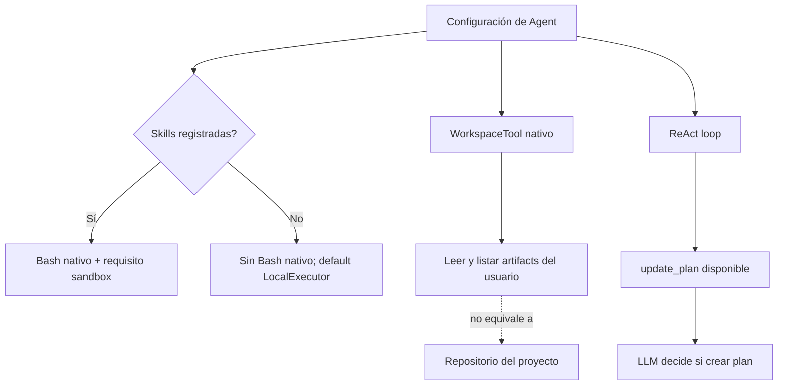
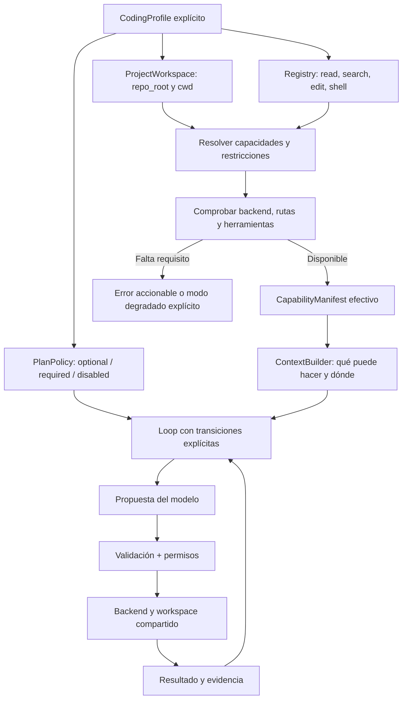

# Por qué MaxAI no siempre planifica, lee el repositorio o ejecuta código

Fecha: 2026-09-11. Evidencia: código local y comprobación sin llamadas al modelo ni ejecución de comandos del agente.

## Resultado

El siguiente cambio prioritario debe ser la **composición de capacidades de coding**, antes que el CompletionGate recomendado en la evaluación anterior. El problema reportado es que el agente no recibe necesariamente las herramientas y el entorno necesarios para trabajar.

## Evidencia por síntoma

| Síntoma | Evidencia directa | Conclusión y límite |
|---|---|---|
| A veces hace plan | `max_ai/base/agent.py:722` y cabecera de `reasoning/react_self_directed.py`: planning nativo pero opcional; el modelo decide llamar a update_plan | VERIFIED: comportamiento previsto, no fallo demostrado del loop |
| No accede al workspace del código | `max_ai/tools/workspace.py:19`: WorkspaceTool lista/lee exclusivamente `<user_id>/artifacts`; solo acciones list/read | VERIFIED: workspace de artefactos no equivale a acceso al repositorio |
| No corre código | `max_ai/manager/capabilities.py:147`: BashTool nativo solo si skills no es None | VERIFIED: sin skills ni Bash explícito no hay Bash nativo |
| Demo sin herramientas de coding | `examples/agent_self_directed_loop.py`, build_agent, registra DEMO_TOOLS y MCP; sin skills. `examples/agent_cli.py` hace lo mismo | VERIFIED para esos ejemplos; UNKNOWN si son el punto de entrada usado en la sesión que falló |
| Bash explícito no activa sandbox | `requires_sandbox_executor` retorna has_skills; `Agent.validate_executor_object` depende de esa propiedad | VERIFIED: desacoplamiento incorrecto entre requisito de ejecución y tipo real de tool. No se ejecutó un comando inseguro para demostrarlo |
| Registry vacío anuncia workspace pero no lo materializa desde Agent | get_native_tools incluye workspace; requires_workspace evalúa has_tools (toolset explícito) o has_skills | VERIFIED: la tool puede usar fallback, pero no recibe necesariamente los deps del workspace configurado |

La UI también calcula su raíz de artefactos desde app.state.workspace_root (`ui/server.py:947`), mientras el Agent materializa desde self.workspace.base_root (`base/agent.py:939`). Con defaults pueden coincidir; overrides independientes pueden divergir. Eso es una **posibilidad inferida**, no un fallo reproducido en la sesión del usuario.

## Comprobación ejecutada

Se instanciaron AgentCapabilities vacío y AgentCapabilities(toolset=[BashTool()]) mediante `uv run --no-sync python`. Resultado:

```text
empty         tools=['workspace']         requires_workspace=False requires_sandbox_executor=False
explicit_bash tools=['bash','workspace']  requires_workspace=True  requires_sandbox_executor=False
```

Esto confirma los flags del registro. No prueba Docker operativo, disponibilidad de Python dentro del contenedor, configuración del proveedor ni el resultado de una tarea end-to-end.

## Conexiones actuales que explican los síntomas



## Componentes propuestos y cómo conectarlos

### Componentes que ya existen en MaxAI

| Componente | Implementación local | Conexión relevante |
|---|---|---|
| Loop y stops | `reasoning/react_self_directed.py` | Agent lo configura; llama al cliente y ToolExecutor |
| Compaction | `compaction/sliding_window.py` | Agent y loop reciben la estrategia y presupuesto |
| Registry | `manager/capabilities.py` | Determina las tools que recibe el ejecutor |
| Dispatch y approval | `base/tool_executor.py` | Valida y aprueba antes de middleware/ejecución |
| Environment | `executor/local.py`, `executor/docker/docker.py` | Backend de ejecución y binding de workspace |
| Sandbox routing | `executor/routing.py` | CoreRuntimeTool selecciona backend sandbox cuando se utiliza este router |
| State | `types/run_context.py`, `core/tool_state.py` | Transcript, llamadas pendientes y estados del run |
| Persistencia | `persistence/core.py`, `persistence/filesystem.py` | Store opcional usado por checkpoints de Agent |
| Memory | `capabilities/memory/local.py`, `sqlite.py` | Capability separada del transcript |
| Guardrails de loop | `reasoning/guards.py` | Steering y veto acotado de finalización |
| Observability | `middleware/console_trace.py`, `logging.py`, `core/event_type.py` | Middleware y eventos de ejecución |

Estos módulos existen: el diagnóstico no es “faltan todos los componentes”. La conexión registry → requisitos → entorno → contexto es donde aparecen los problemas concretos.

Otro desajuste verificable: BashTool describe instalación de paquetes, pero el contenedor persistente se arranca con `--network none` (`executor/docker/docker.py:405`). Las instalaciones que necesiten descargar paquetes fallarán salvo que los recursos ya estén disponibles. La solución propuesta es describir la red efectiva y preparar dependencias en la imagen, no habilitar red sin política.



Todo este diagrama es **PROPOSED**. No representa módulos ya implementados ni una arquitectura atribuida a una empresa.

### 1. ProjectWorkspace separado de ArtifactWorkspace

Mantener artefactos con su finalidad actual. Añadir un contrato de proyecto que defina repo_root, cwd, rutas permitidas y traducción host/contenedor. UI, tools y shell deben consumir la misma definición. No resolver el problema eliminando las restricciones de WorkspaceTool.

### 2. Shell independiente de Skills

Skills aportan instrucciones y recursos; shell aporta ejecución. Habilitar shell explícitamente en un perfil de coding. Calcular el requisito de sandbox según las tools efectivas y sus capacidades, no según la presencia de skills. Revisar también tools registradas dinámicamente antes de ejecutar.

### 3. Registry efectivo y preflight

Tras preparar capabilities, producir un manifiesto: tools disponibles, backend, cwd efectivo, alcance de archivos, aprobación y disponibilidad. El contexto debe describir ese manifiesto real. Si falta Docker o el runtime solicitado, devolver un diagnóstico antes de que el modelo prometa ejecutar código. La comprobación debe ser proporcional: no arrancar contenedores para un chat que no necesita ejecución.

### 4. Planning como política configurable

Conservar optional para chat. Para runs que lo requieren, `required` debe bloquear acciones de modificación hasta registrar un plan válido, con presupuesto y salida de fallo si el modelo no lo produce. Permitir las lecturas necesarias para formularlo. No convertir un prompt “haz un plan” en una supuesta garantía del runtime.

### 5. Diagnóstico observable

Emitir eventos que distingan: tool no registrada, ruta fuera de alcance, aprobación pendiente, backend no disponible, ejecución fallida y decisión del modelo de no usar tools. Hoy los síntomas del usuario no identifican cuál de esos casos ocurrió en cada sesión.

## Orden de implementación propuesto

1. Corregir cálculo de requisitos desde tools efectivas y cubrir Bash explícito sin skills.
2. Crear configuración de ProjectWorkspace y perfil coding; mantener el perfil de artefactos existente.
3. Compartir binding de workspace entre UI, prompt y ejecutores; validar con un archivo temporal dentro del proyecto autorizado.
4. Añadir preflight y manifiesto visible del run.
5. Añadir PlanPolicy configurable y luego CompletionGate para tareas verificables.

Aceptación futura: sin skills, el perfil coding puede leer un archivo autorizado, editar una copia temporal y ejecutar una comprobación inocua mediante su backend; ante backend ausente falla explícitamente. El plan required precede las modificaciones; optional sigue permitiendo respuestas simples. No se cambiaron permisos ni se habilitó ejecución local implícita en esta evaluación.
