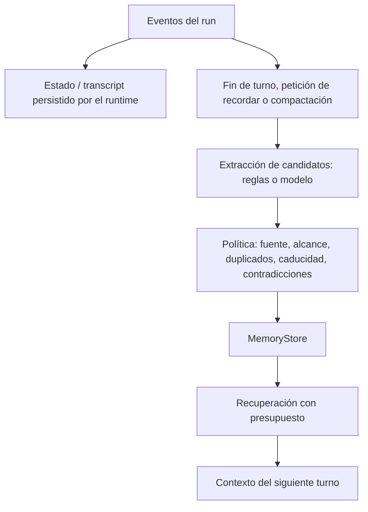
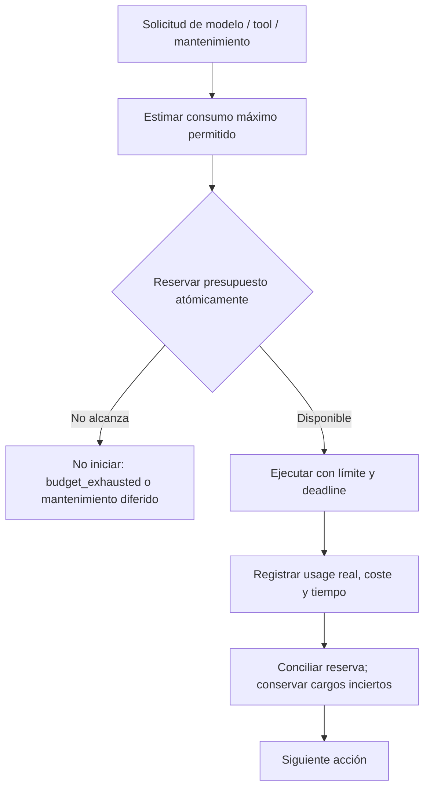

# Memoria, finalización y presupuestos

Evaluación del código local, 2026-09-11. Las interfaces siguientes son propuestas, no cambios implementados.

## Memoria: separar captura, selección y persistencia

VERIFIED: `base/memory.py` expone CRUD al modelo según MemoryToolMode; también ofrece métodos programáticos. `stacks/memory_layer.py` incorpora recuerdos al contexto. `base/agent.py:575`, `_maintain_memory_after_compaction`, inicia una llamada al modelo con MemoryMaintenanceOutput, aplica updates con `memory.upsert` y registra fallos sin abortar el run. Por tanto, no toda captura depende de que el agente decida llamar una tool: el harness ya tiene un trigger automático, pero la selección semántica sigue delegada al modelo. Este trigger no demuestra mantenimiento en todos los finales ni en todas las rutas de compactación.

La memoria de trabajo contiene mensajes recientes, resultados y contexto seleccionado. El estado de sesión conserva hechos de ejecución. La memoria a largo plazo conserva información reutilizable seleccionada; no debe confundirse con guardar todo el transcript.

PROPOSED: MemoryManager controla cuándo recuperar, extraer, validar y guardar. Puede usar un modelo como extractor, sin cederle autoridad sobre la política de persistencia:

Guardar automáticamente un recibo de una tool es registro operativo, no necesariamente memoria semántica. “Email aceptado por proveedor” proviene de la tool, no de la frase del modelo “ya lo envié”. Una preferencia explícita del usuario puede convertirse en memoria; una inferencia del modelo debe conservar su condición de candidata y procedencia. Políticas de rechazo y borrado se aplican en código, no solo mediante instrucciones al extractor.

## Guardrail y CompletionGate resuelven preguntas distintas

- Guardrail/policy: ¿está permitida esta acción, con estos argumentos, identidad y recursos?
- CompletionGate: ¿qué requisitos están satisfechos y con qué evidencia?
- BudgetManager: ¿podemos autorizar este consumo adicional?

No hace falta una clase para cada petición. Combinar validadores de capacidades reutilizables con requisitos por tarea. El usuario o la aplicación define el alcance; un modelo puede proponer una descomposición, pero no debilitar unilateralmente los requisitos.

| Petición | Requisitos | Evidencia | Límite |
|---|---|---|---|
| Escribir poema | Texto y restricciones explícitas como idioma o número de versos | Artefacto textual y checks de formato configurados | No hay verificador universal de calidad literaria |
| Escribir poema y enviarlo | Poema + destinatario autorizado + envío de esa versión | Hash/versión de contenido y recibo vinculado de la tool | Aceptación del proveedor no prueba entrega ni lectura |
| Escribir código | Cambios o archivo solicitado | Diff/artefacto | No implica haberlo ejecutado |
| Ejecutar código | Ejecución solicitada en entorno permitido | Comando, cwd, exit code, stdout/stderr | Exit code cero no prueba corrección funcional completa |
| Corregir un bug | Cambio y criterios de aceptación relevantes | Diff y checks vinculados a la revisión actual | Tests elegidos insuficientes pueden no probar el requisito |

Para una tarea compuesta, el mismo gate agrega requisitos. Si existe el poema pero falla el envío, responde `partial`; no vuelve a generar el poema innecesariamente ni reenvía a ciegas ante un timeout con resultado incierto. La aprobación humana se requiere cuando lo indique la autorización/política, no siempre para cada email. La autorización del usuario puede cubrir ya el envío solicitado.

Resultados propuestos: `satisfied`, `failed`, `blocked`, `unknown`, `not_applicable` por requisito; resultado agregado `completed`, `partial`, `failed`, `blocked`, `unverified`, `cancelled` o `budget_exhausted`. “completed” debe expresar el alcance comprobado, sin prometer que toda calidad subjetiva fue verificada.

## Presupuestos: lo observado y lo que falta

VERIFIED: `core/models.py`, AgentConfig, configura max_loop_iterations y tool_timeout. `base/reasoning.py` acumula tokens y conserva contadores al reanudar. Agent y compaction calculan espacio disponible en la ventana. `reasoning/guards.py`, BudgetGuard, avisa sobre iteraciones; el loop aplica el tope.

INFERRED GAP: no se identificó un ledger global que aplique límites acumulados de tokens, dinero y tiempo del run en los caminos revisados. Contar tokens no es bloquear gasto; ajustar la ventana no limita el consumo de veinte llamadas sucesivas. El mantenimiento de memoria llama directamente al cliente desde Agent, por lo que limitar solo el loop no cubre todo el gasto.

PROPOSED: un BudgetManager compartido por llamadas principales, retries, resúmenes, extracción de memoria, subagentes y herramientas facturables.

Campos mínimos: tokens de entrada/salida acumulados, coste estimado y confirmado, reservas activas, deadline, tiempo activo, tool calls e iteraciones. Configurar si el tiempo de espera humana cuenta; persistir consumo al pausar y reanudar. Cada llamada tiene un output máximo compatible con el remanente y timeout limitado por el deadline global. Reservas atómicas evitan que dos tools/subagentes gasten simultáneamente el mismo saldo.

El precio es configuración versionada por proveedor/modelo/categoría, no una constante universal; cache y reasoning pueden tener contabilización propia. Si falta precio, marcar coste desconocido o bloquear bajo un límite monetario estricto, no asumir cero. Cancelar un stream puede dejar cargos en tránsito: distinguir límite de admisión estimado de garantía absoluta de factura.

Reservar una pequeña parte para comunicar el resultado final; si se agota todo, producir una respuesta determinista desde el estado sin otra llamada al modelo. No continuar gastando para explicar que se agotó el presupuesto.

## Orden propuesto

1. Resolver capacidades/workspace identificados en el diagnóstico 03.
2. Introducir ledger de presupuestos en la frontera común de llamadas y ejecución, incluyendo mantenimiento.
3. MemoryManager con triggers y políticas explícitas, reutilizando backends existentes.
4. CompletionGate genérico con evidencia y validadores reutilizables por capability.

No se necesita un harness diferente para poemas, emails y código: se necesita composición explícita de capacidades, requisitos, evidencia y límites.
