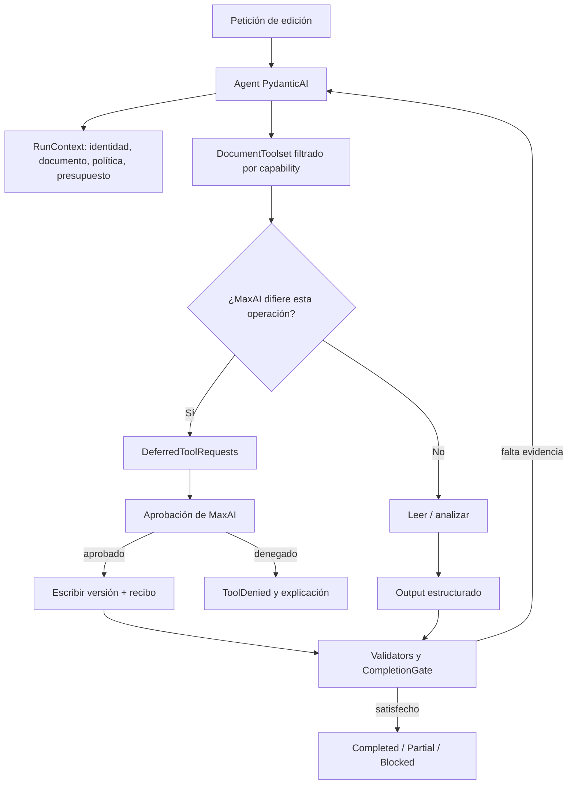

# PydanticAI como base para migrar el agente documental de MaxAI

Fecha de verificación: 2026-09-11. Alcance: primera migración de edición documental, presupuestos, memoria controlada y finalización; multiagente después. Coding, repositorio y git quedan fuera. Las afirmaciones marcadas **VERIFIED** proceden de documentación o repositorio oficial consultado en esta fecha; **INFERRED** es una lectura arquitectónica para MaxAI; **UNKNOWN** no queda garantizado por las fuentes revisadas.

## Veredicto: sí existe “Pydantic AI Harness”, pero no es otro runtime

**VERIFIED.** La búsqueda del término no debe concluir que “harness” es solo una metáfora: existe el repositorio oficial [pydantic/pydantic-ai-harness](https://github.com/pydantic/pydantic-ai-harness), la documentación [Pydantic AI Harness](https://pydantic.dev/docs/ai/harness/) y el paquete `pydantic-ai-harness`. El repositorio se describe como biblioteca oficial de capabilities para PydanticAI. La release visible al verificar fue [v0.30.0](https://github.com/pydantic/pydantic-ai-harness/releases/tag/v0.30.0), commit `8e863b5`; la página muestra fecha 2026-09-08 y el timestamp/anuncio de GitHub aparece el 2026-09-09 UTC. Su política de versión 0.x permite cambios incompatibles en minor releases.

La distinción es esencial: [PydanticAI core](https://pydantic.dev/docs/ai/core-concepts/agent/) contiene el `Agent`, el loop tipado, mensajes, llamadas al modelo, herramientas, outputs estructurados, dependencias y límites de uso. Harness añade bloques composables: memoria, planificación, guardrails, gestión de contexto, `SubAgents`, filesystem, shell, spend limits y agentes compuestos como `Coder`. La documentación dice que cada capability agrupa herramientas, hooks, instrucciones y settings; `Coder` se puede desmontar en piezas. Por tanto, “harness” aquí significa una capa de capacidades de aplicación sobre el loop, con una implementación oficial distribuida como paquete, no un scheduler universal que deba reemplazar el runtime de MaxAI.

### Estructura oficial del código

**VERIFIED.** Estas rutas del código fuente permiten separar el runtime que ejecuta un agente de las implementaciones opcionales del Harness:

| Área | Ruta oficial | Responsabilidad visible |
|---|---|---|
| Core: API del agente | [`pydantic_ai_slim/pydantic_ai/agent/__init__.py`](https://github.com/pydantic/pydantic-ai/blob/main/pydantic_ai_slim/pydantic_ai/agent/__init__.py) | `Agent`, métodos `run*`, `iter` y tipos públicos del run |
| Core: nodos del loop | [`pydantic_ai_slim/pydantic_ai/_agent_graph.py`](https://github.com/pydantic/pydantic-ai/blob/main/pydantic_ai_slim/pydantic_ai/_agent_graph.py) | nodos de prompt, request de modelo, tools y finalización |
| Core: ejecución del run | [`pydantic_ai_slim/pydantic_ai/run.py`](https://github.com/pydantic/pydantic-ai/blob/main/pydantic_ai_slim/pydantic_ai/run.py) | `AgentRun`, avance y resultados del run |
| Core: grafo genérico | [`pydantic_graph/`](https://github.com/pydantic/pydantic-ai/tree/main/pydantic_graph) | FSM tipada, nodos, `End`, contexto y ejecución del grafo |
| Harness: memoria | [`pydantic_ai_harness/memory/`](https://github.com/pydantic/pydantic-ai-harness/tree/main/pydantic_ai_harness/memory) | capability, stores y recuperación de memoria |
| Harness: planificación | [`pydantic_ai_harness/planning/`](https://github.com/pydantic/pydantic-ai-harness/tree/main/pydantic_ai_harness/planning) | plan, tools y stores de plan |
| Harness: gasto | [`pydantic_ai_harness/spend/`](https://github.com/pydantic/pydantic-ai-harness/tree/main/pydantic_ai_harness/spend) | `SpendLimits`, presupuestos, stores e idempotencia |
| Harness: delegación | [`pydantic_ai_harness/subagents/`](https://github.com/pydantic/pydantic-ai-harness/tree/main/pydantic_ai_harness/subagents) | capability `SubAgents` y ejecución de delegados |

La tabla documenta ubicación y responsabilidad del código oficial; no implica que MaxAI deba adoptar esas implementaciones ni que esas APIs 0.x sean contratos estables.

**INFERRED para MaxAI.** El hallazgo reutilizable es el modelo de composición y algunos contratos, manteniendo el runtime propio de MaxAI donde ya resuelve aprobación, workspace, persistencia, memoria y estados. La comparación útil es “PydanticAI como posible frontera de agente y tipos”, sin copiar ciegamente `Coder` ni convertir un paquete 0.x en autoridad sobre políticas de documentos.

## Loop, contexto y herramientas

**VERIFIED.** Un `Agent` es una configuración reutilizable de instrucciones, tools/toolsets, output type, dependencias, modelo, settings y capabilities. Se puede ejecutar con `run`, `run_sync`, streaming de texto/eventos o `iter`; `iter` expone los nodos del grafo interno del run. El flujo base es: petición de modelo → cero o más llamadas de tool y sus resultados → validación de output o retry → output final. La documentación también advierte que `run_stream()` puede considerar final el primer output que coincide con el tipo configurado; llamadas adicionales quedan sin ejecutar con la estrategia por defecto. Para MaxAI, una tarea de edición debe consumir eventos completos o iteración del run cuando la evidencia de escritura y validación importa.

`pydantic_graph` ofrece control explícito mediante nodos, decisiones, joins y ejecución paralela: [Graph](https://pydantic.dev/docs/ai/graph/graph/). No hace falta usarlo para cada conversación. **INFERRED:** el loop de un solo documento puede permanecer en `Agent`; el gate de finalización puede ser un estado de aplicación alrededor del run. Graph merece entrar cuando MaxAI tenga pasos obligatorios y verificables, por ejemplo `load → propose → policy decision → write → validate → complete`, o cuando haya ramas y reanudación que el loop conversacional no exprese bien.

Las dependencias son inyección tipada para prompts dinámicos, tools y validadores: [Dependencies](https://pydantic.dev/docs/ai/core-concepts/dependencies/). Un `RunContext` puede recibir un objeto que contenga identidad, `DocumentStore`, `Policy`, `BudgetManager`, `ApprovalStore` y `MemoryReader`. Los toolsets son colecciones componibles que pueden combinarse, filtrarse, prefijarse, cargarse dinámicamente y envolver la ejecución: [Toolsets](https://pydantic.dev/docs/ai/tools-toolsets/toolsets/). **INFERRED:** este encaja mejor con el registry de MaxAI que registrar tools sueltas: un `DocumentToolset` debería exponer solo leer, localizar, proponer cambios, aplicar una versión y validar, con permisos derivados de deps y de la política del run.

El siguiente flujo es **INFERRED** y propone una posible integración de PydanticAI con las políticas y stores que MaxAI ya posee; no describe la arquitectura actual ni exige aprobación para toda tool con efectos. La aplicación decide qué operaciones son diferibles, cuáles están preautorizadas y qué controles adicionales requiere cada capability.

## Historial, memoria y compacción

**VERIFIED.** PydanticAI es stateless a nivel de `Agent`; la conversación continúa pasando `message_history` de un resultado a otro. La documentación permite validar y sanitizar historiales recibidos desde clientes antes de reutilizarlos: [Messages and chat history](https://pydantic.dev/docs/ai/core-concepts/message-history/). También existe `history_processors` en el ecosistema y en Harness hay capacidades de contexto/compacción. Eso es transporte y selección de contexto, no automáticamente una memoria semántica de usuario.

**VERIFIED.** Harness ofrece [Memory](https://pydantic.dev/docs/ai/harness/memory/) y almacenamiento configurable, y [Planning](https://pydantic.dev/docs/ai/harness/planning/) mantiene por defecto un plan aislado en memoria por run o lo persiste con stores como SQLite/Postgres. La planificación no se inyecta como prompt mutable permanente: se presenta como recordatorio efímero, y los cambios llegan por tools. Es un patrón útil para no contaminar todo el transcript.

**INFERRED para MaxAI.** La autoridad sobre memoria debe seguir en MaxAI. Persistir el historial completo sirve para auditoría y reanudación, pero no convierte todas las frases en recuerdos. La memoria controlada debería recibir eventos de hechos observables (versión aplicada, validación, preferencia explícita), guardar procedencia y alcance, y decidir en código qué recuperar. Se puede exponer a PydanticAI como dependencia/servicio y usar Harness Memory como implementación opcional, pero debe haber filtros de tenant, documento, caducidad y borrado fuera del modelo. La compacción puede reducir contexto; no debe borrar el registro de evidencia ni el estado del gate.

## Validación de output frente a aceptación de la tarea

**VERIFIED.** `output_type` valida y tipa el resultado estructurado. `agent.output_validator` permite validación síncrona o asíncrona, incluida IO; si lanza `ModelRetry`, el modelo recibe otra oportunidad. Cada retry consume el presupuesto de output retry, cuyo default documentado es 1 y puede configurarse con `retries={'output': N}`: [Output](https://pydantic.dev/docs/ai/core-concepts/output/). La validación asegura forma, tipos y condiciones implementadas; no prueba que un documento haya sido escrito, que el contenido corresponda a la versión solicitada o que una operación externa haya terminado.

**INFERRED.** MaxAI necesita conservar un `CompletionGate` separado. El validator puede producir `EditProposal` válido y verificar invariantes locales. El gate debe comprobar evidencia externa: documento objetivo, versión/hash, diff aplicado, permisos, resultado de validación y cualquier requisito del encargo. Estados recomendados: `satisfied`, `failed`, `blocked`, `unknown`; el estado agregado puede ser `completed`, `partial` o `unverified`. Un texto del modelo que diga “guardado” nunca debe sustituir al recibo de `DocumentStore`.

## Presupuestos: límites exactos y huecos

**VERIFIED.** El core ofrece `UsageLimits` por run para tokens, requests, tool calls y coste: [Usage limits](https://pydantic.dev/docs/ai/core-concepts/agent/#usage-limits). Los campos documentados incluyen `request_limit`, `tool_calls_limit`, límites acumulados de input/output tokens, `per_request_input_tokens_limit` para el tamaño de una petición individual y `cost_limit` en USD. El contador devuelve `RunUsage` con coste, input tokens, output tokens y requests; el exceso lanza `UsageLimitExceeded` antes de la siguiente acción cuando el límite aplica. `max_tokens` del model settings limita la salida de una petición, no el presupuesto total del run. Retries consumen requests y pueden consumir output-retry budget.

Hay que ser preciso con las limitaciones: estos límites son de un run y del mecanismo de uso del modelo; no son por sí solos un ledger de presupuesto compartido entre sesiones, coste de una tool externa, almacenamiento o dinero reservado para dos acciones concurrentes. El core sí documenta [timeouts](https://pydantic.dev/docs/ai/core-concepts/timeouts/): `ModelSettings.timeout` acota un intento de petición cuando el proveedor lo soporta, `Agent(tool_timeout=...)` o un timeout de tool acota function tools, y MCP tiene timeouts de conexión/lectura. Ninguno acota por sí solo el wall-clock total del run; para eso la documentación indica envolver `agent.run()` en `asyncio.timeout`/`anyio.fail_after()` o cancelar con `CancellationToken`. **UNKNOWN** en las fuentes core revisadas: una garantía universal de deadline total y límite monetario atómico para toda una aplicación.

**VERIFIED.** Harness tiene [SpendLimits](https://pydantic.dev/docs/ai/harness/spend/), con presupuestos por ventana temporal y stores; su documentación trata idempotencia en replay y advierte que el store en memoria no sobrevive al cambio de proceso. Es más cercano al límite monetario acumulado de MaxAI, pero sigue siendo una capability 0.x y no sustituye un ledger de negocio si los cargos incluyen tools o proveedores no cubiertos.

**INFERRED para MaxAI.** Mantener un `BudgetManager` propio como dependencia compartida: reservar antes de modelo/tool, registrar uso real, reconciliar reservas, aplicar deadline, y reservar margen para la respuesta final determinista. Pasar `usage_limits` al Agent añade un guardrail útil; no debe ser la única defensa. La delegación futura debe compartir el objeto de uso o una cuenta con reservas atómicas.

## Aprobación diferida, reanudación y durable execution

**VERIFIED.** Una tool puede declarar `requires_approval=True` o lanzar `ApprovalRequired`; el run devuelve `DeferredToolRequests` con tool, argumentos validados, IDs y metadata. Después se construye `DeferredToolResults` con aprobado, denegado u override de argumentos y se reanuda pasando el historial original más esos resultados: [Deferred tools](https://pydantic.dev/docs/ai/tools-toolsets/deferred-tools/). `HandleDeferredToolCalls` puede resolver solicitudes inline. La propia documentación advierte que la aprobación enviada por un cliente no es una frontera de autorización: la tool debe autenticar y autorizar en servidor.

**VERIFIED.** PydanticAI documenta durable execution con integraciones co-mantenidas para Temporal, DBOS, Prefect, Restate y AWS Lambda, y SDKs externos para Kitaru y Airflow: [Durable execution](https://pydantic.dev/docs/ai/capabilities/durable_execution/overview/). Permite sobrevivir a fallos, reinicios, esperas largas y human-in-the-loop. Harness `StepPersistence` añade stores de pasos, identidad de run, eventos, snapshots y efectos de tools; eso prueba que la reanudación requiere persistencia y semántica idempotente, no solo conservar mensajes.

**INFERRED para la primera fase.** MaxAI puede implementar aprobación con su store actual y mapear el contrato de deferred calls, sin introducir Temporal todavía. Antes de una integración durable hay que fijar IDs de run/step/tool, efectos idempotentes, estado `pending_approval`, expiración y qué ocurre con timeout o resultado externo incierto. Temporal/DBOS/etc. son una fase posterior cuando la edición documental deba sobrevivir reinicios o esperar horas.

## Instrumentación y multiagente

**VERIFIED.** La capability [Instrumentation](https://pydantic.dev/docs/ai/capabilities/instrumentation/) usa OpenTelemetry y puede configurarse con Logfire; los runs, requests y tool calls quedan observables. Esto aporta trazas, no corrección de negocio: el CompletionGate debe emitir eventos propios vinculados a versión y evidencia.

**VERIFIED.** La guía de [multi-agent applications](https://pydantic.dev/docs/ai/guides/multi-agent-applications/) distingue delegación por tool, hand-off programático, graph control-flow y agentes autónomos. Harness `SubAgents` reenvía deps, comparte usage por defecto y aplica límites del padre al árbol; cada delegado tiene su propio message history y no ve automáticamente la conversación padre. Puede desactivarse con `forward_usage=False`. La capacidad conserva un contrato claro, pero un subagente que comparte deps todavía debe recibir alcance documental y permisos explícitos.

**INFERRED.** Posponer multiagente hasta que un agente documental único complete bien `leer → proponer → aprobar → aplicar → verificar`. Después, usar subagentes read-only para extracción, revisión o búsqueda; mantener aplicación de cambios y CompletionGate en el agente coordinador. Compartir presupuesto, identidad, correlation IDs y memoria seleccionada; no compartir automáticamente historial completo ni autoridad de escritura.

## Material de decisión para 06

Si la migración de 06 decide incorporar PydanticAI, las piezas con mejor encaje son `Agent`, `RunContext`, `toolsets`, outputs tipados, `UsageLimits`, `DeferredToolRequests` y eventos. `pydantic-ai-harness` puede evaluarse como fuente de patrones y capabilities aisladas, fijando versión y probándolo detrás de interfaces MaxAI por su estado 0.x. El contrato de MaxAI seguiría definiendo `DocumentToolset`, `EditProposal`, CompletionGate, memoria, presupuesto y reanudación; Harness no los impone. `SpendLimits` sería defensa complementaria, no reemplazo del ledger.

No migrar todavía filesystem/shell/Coder, Graph completo, durable backend ni SubAgents. Revisar Graph cuando los estados obligatorios de edición estén formalizados; durable execution cuando haya reanudaciones prolongadas; multiagente cuando existan tareas read-only paralelizables y métricas que justifiquen su coste. Esta secuencia reutiliza interfaces maduras del core y evita trasladar al producto las suposiciones de un agente de coding.
