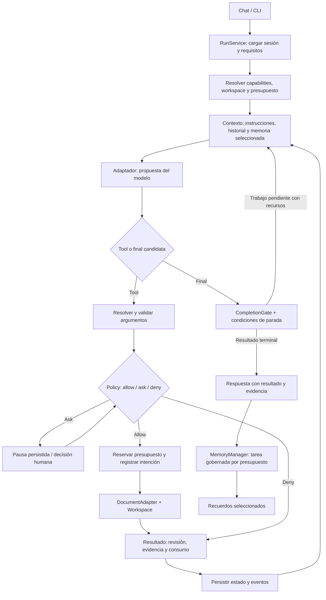

# Plan de migración: MaxAI Document Harness

Estado: **plan propuesto; implementación no iniciada**. Fecha: 2026-09-11.

## 1. Objetivo y alcance

Convertir la composición actual en un harness predecible para leer, crear y editar documentos, conservando los adaptadores, tools, ejecutores y componentes útiles. El modelo interpreta y propone; el runtime controla capacidades, autorización, estado, persistencia, memoria, presupuestos y resultados.

Primer recorrido de aceptación: **abrir un documento existente autorizado, cambiar una sección y guardar una nueva versión**, mostrando qué cambió, qué se comprobó y cuánto consumió. Debe funcionar sin skills ni shell para las operaciones documentales soportadas.

Alcance inicial: texto y Markdown como recorrido mínimo comprobable; después DOCX mediante adaptador específico. PDF, hojas de cálculo y presentaciones requieren contratos de formato propios y se incorporarán individualmente; no se prometerá edición genérica de cualquier binario. Los primeros formatos son una decisión de secuenciación propuesta, no una limitación definitiva del producto.

Fuera de esta primera migración: agente de programación, checkout/worktrees Git, ejecución arbitraria de código y despliegues. Git no es requisito del workspace documental. Las automatizaciones de email existentes pueden mantenerse, pero no se enviarán mensajes reales durante las pruebas.

## 2. Base de decisión

1. [Diagnóstico local](03-diagnostico-capabilities.md): workspace limitado a artifacts, Bash nativo dependiente de skills y cálculo incompleto de requisitos.
2. [Memoria y presupuestos](04-memoria-gates-presupuestos.md): mantenimiento de memoria ya existente, límites parciales y ausencia identificada de un ledger global.
3. [Grok / DeepSeek / OpenCode, investigación de Luna](02-componentes-open-source.md): separar composición, herramientas, workspace, ejecución y políticas; planificar no es obligatorio en cada prompt.
4. [Pydantic AI, investigación de Luna](05-pydantic-ai-luna.md): core de ejecución y biblioteca oficial de capabilities separados; composición tipada, límites de uso, aprobaciones diferidas y subagentes.

Este plan no presupone reemplazar MaxAI por Pydantic AI ni añadirlo como dependencia. La comparación es arquitectónica; cualquier adopción de runtime externo necesitaría una prueba de compatibilidad y una decisión separada.

## 3. Contratos propuestos

Los nombres siguientes son responsabilidades lógicas. No requieren una clase o microservicio por fila. Ubicaciones nuevas se decidirán según las convenciones del repositorio durante la implementación.

| Contrato | Posee | Reutiliza / conecta con |
|---|---|---|
| RunService | Ciclo de vida, identidad, sesión y coordinación del run | Agent, RunContext, UI/CLI |
| CapabilityManifest | Tools efectivas, formatos soportados, backend y alcance | AgentCapabilities, ToolExecutor |
| DocumentWorkspace | Raíz, document_id, revisiones y rutas autorizadas | WorkSpaceRegistry, WorkspaceTool y UI |
| DocumentAdapter | Lectura estructurada, cambios y validación de un formato | Tools documentales explícitas |
| PolicyDecision | allow / ask / deny, motivo y alcance | Validación y aprobación existentes |
| RunBudget | Límites, reservas y consumo de todas las actividades | Cliente, ejecutores y tareas auxiliares |
| MemoryManager | Triggers, selección, validación y recuperación | Backends de memoria y MemoryLayer |
| TaskRequirements | Qué se pidió y qué evidencia satisface cada parte | Contexto del run y validadores |
| CompletionDecision | Continuar, completar, parcial, bloquear o fallar | Salidas del loop y respuesta pública |
| ExecutionEvent | Identidad, secuencia, acción, estado, evidencia y consumo | Eventos/middleware/SSE existentes |
| DelegationScope | Subtarea, permisos reducidos y presupuesto compartido | Subruns del mismo RunService |

### Flujo objetivo

Memoria posterior al run puede diferirse si no hay presupuesto, pero debe registrarse como pendiente/omitida. La ejecución de una tool no implica repetir todo el pipeline de memoria o verificación. Las verificaciones se disparan cuando su evidencia es necesaria.

## 4. Invariantes de la migración

- Ningún prompt puede habilitar una tool ausente ni ampliar los permisos del workspace.
- Las tools de documentos no requieren Bash por defecto.
- Un recuerdo semántico no sustituye al registro de ejecución.
- El presupuesto incluye retries, compactación, memoria y futuros subagentes.
- Una aprobación queda vinculada a la operación y sus argumentos normalizados; cambios relevantes requieren reevaluación.
- Una escritura exige la revisión esperada; un conflicto no se resuelve sobrescribiendo silenciosamente.
- Reanudar no reinicia el saldo ni repite automáticamente un efecto con resultado desconocido.
- La evidencia identifica la versión comprobada. Modificar después puede invalidarla.
- Eventos a UI y estado del runtime describen el mismo resultado; SSE no es la fuente durable de verdad.

## 5. Fases y dependencias

### F0 — Baseline y contratos de compatibilidad

**Trabajo:** fijar la revisión local usada como baseline; inventariar puntos de entrada, configuración, eventos y formato de RunContext. Reproducir los escenarios del diagnóstico con cliente simulado. Documentar qué estado mutable comparte Agent antes de cambiar concurrencia.

**Archivos afectados al implementar:** ejemplos, tests existentes y documentación de contratos; sin alterar comportamiento de producción.

**Entregable:** fixtures y escenarios de comportamiento actual; registro de decisiones de compatibilidad.

**Salida:** puede distinguirse tool ausente, ruta fuera de alcance, aprobación pendiente, backend no disponible y decisión del modelo de no usar tools. Las pruebas no requieren servicios externos.

### F1 — Composición explícita y binding documental

**Trabajo:** añadir perfil `documents`; resolver requisitos desde las herramientas efectivas. Corregir el caso Bash explícito sin skills sin habilitar ejecución insegura. Publicar CapabilityManifest con herramientas y formatos reales. Centralizar el binding usado por Agent, tools y UI. Separar el repositorio del framework del workspace de documentos del usuario.

**Puntos de integración:** `manager/capabilities.py`, `base/agent.py`, `base/workspace.py`, `workspace/system.py`, `tools/workspace.py`, `ui/server.py`.

**Salida:** el perfil documents funciona sin skills ni Docker para operaciones documentales locales autorizadas; un runtime tool que necesita sandbox y carece de backend queda rechazado antes del efecto. Workspace, UI y tools resuelven el mismo documento.

**Compatibilidad:** conservar el comportamiento read-only de WorkspaceTool existente; introducir las nuevas operaciones mediante capacidades explícitas. No convertir automáticamente toda ruta del host en documento accesible.

### F2 — Estado del run, budgets, policy y eventos comunes

**Trabajo:** introducir ledger compartido con límites de tokens, coste y tiempo; reservas atómicas; límites por llamada y conciliación de usage. Aplicar la frontera también a las llamadas auxiliares directas del Agent. Asegurar persistencia de pausas, aprobaciones y saldo. Definir decisiones de policy reutilizables. Emitir eventos de admisión, rechazo, uso y transiciones.

**Puntos de integración:** `core/models.py`, `base/clients.py`, `base/agent.py`, `base/tool_executor.py`, `types/run_context.py`, `persistence/`, `core/event_type.py`, middleware y UI.

**Decisiones explícitas:** tiempo activo y tiempo esperando al usuario se contabilizan por separado; el perfil define el deadline. Tarifas configuradas/versionadas, sin precio ficticio cero. Las garantías monetarias son de admisión conservadora y conciliación, no de cancelación retroactiva de cargos.

**Salida:** una segunda llamada no puede consumir saldo reservado por otra; resume conserva gasto; agotamiento produce estado terminal explícito. Sin saldo para responder con el modelo, se construye una respuesta desde el estado. Un fallo de guardrail obligatorio bloquea, no se omite como steering best-effort.

**Dependencia:** F1. Es requisito antes de habilitar escritura documental en el nuevo perfil de uso normal.

### F3 — Lectura, edición y versiones de documentos

**Trabajo:** operaciones tipadas para listar, leer, proponer/aplicar cambios y guardar una nueva revisión. Primer adaptador texto/Markdown; segundo adaptador DOCX que preserve la estructura soportada. No reemplazar un documento rico por texto plano.

**Contrato mínimo:** document_id, base_revision, tipo de operación, selección inequívoca de sección/contenido, resultado con new_revision, diff o resumen y comprobaciones. Guardado atómico con recuperación; validar paths y symlinks en la frontera de filesystem, no solo en el prompt. Política de retención explícita para versiones.

**Salida:** “modifica esta sección” conserva las demás secciones; una versión antigua genera conflicto; se puede recuperar la anterior. DOCX exige fixtures que comprueben contenido y estructura relevante; elementos no soportados se reportan antes de una transformación destructiva.

**Dependencia:** F1 + F2. Una operación de edición sobre copias temporales puede desarrollarse en paralelo, pero no se habilita antes de sus controles.

### F4 — Memoria gobernada por el harness

**Trabajo:** extraer coordinación de mantenimiento desde Agent a MemoryManager reutilizando storage. Distinguir journal, resumen de sesión y recuerdos semánticos. Triggers: petición explícita de recordar, cierre pertinente del turno y compactación. Evitar procesar dos veces el mismo evento.

**Política:** procedencia, user/session scope, caducidad, conflicto y eliminación. El extractor puede ser LLM, pero sus candidatos se validan. Recuperar con presupuesto; no cargar todo el almacenamiento indiscriminadamente. Mantener aislamiento entre usuarios.

**Puntos de integración:** `base/memory.py`, `capabilities/memory/`, `stacks/memory_layer.py`, `_maintain_memory_after_compaction` y callbacks de RunService.

**Salida:** un resultado de ejecución existe aunque el modelo no lo recuerde; una preferencia explícita puede recuperarse en otra sesión; una afirmación inventada del asistente no se promueve a hecho confirmado. Mantenimiento agotado se difiere sin ocultar su estado ni gastar fuera del ledger.

**Dependencia:** F2; puede desarrollarse en paralelo con F3 si los contratos de eventos ya están fijados.

### F5 — PlanPolicy, stop conditions y CompletionGate

**Trabajo:** definir planning `optional`, `required`, `disabled` por perfil/run. Required permite las lecturas necesarias, pero requiere un plan válido antes de acciones de modificación. Presupuesto y salida de bloqueo evitan un bucle infinito si el modelo no logra planificar.

**CompletionGate:** componer requisitos y validadores reutilizables. Poema: contenido/forma solicitada; documento: revisión guardada y cambios requeridos; email: recibo de aceptación ligado al contenido y destinatario autorizados. No exigir un evaluador de calidad universal ni una clase por petición.

**Stops:** finalización candidata, cancelación, deadline, saldo insuficiente, repetición sin progreso y bloqueo por información/aprobación. Mantener separados stop del loop y resultado de tarea.

**Salida:** documento guardado con envío fallido es `partial`; testimonio textual del modelo no acredita un envío. Una tarea conversacional simple termina sin tools ni plan artificial. Todas las salidas terminales y shortcuts del loop pasan por clasificación coherente.

**Puntos de integración:** `reasoning/react_self_directed.py`, `reasoning/guards.py`, tipos de respuesta, RunContext y UI/CLI.

**Dependencia:** F2 + F3; debe recibir también los eventos de memoria de F4 cuando corresponda.

### F6 — Consolidación en UI/CLI y habilitación progresiva

**Trabajo:** UI y CLI como adaptadores de RunService; mostrar documentos/revisiones, evidencia, permisos y presupuestos. Añadir recuperación de eventos por secuencia. Revisar estado compartido antes de reemplazar el lock global; usar control por sesión y por documento para operaciones conflictivas.

**Salida:** reconectar reconstruye el mismo resultado; dos sesiones independientes no mezclan contextos; dos escritores sobre la misma revisión no pierden cambios. Un run se mantiene en el mismo motor al reanudar.

**Dependencia:** F3 + F4 + F5. Observabilidad básica ya comenzó en F2; esta fase consolida experiencia y concurrencia.

### F7 — Multiagent acotado

**Trabajo:** delegación como subrun del mismo runtime, con parent_run_id, task_id, contexto mínimo explícito, permisos iguales o menores, cuota y deadline derivados del presupuesto global. Cancelación descendente y resultados tipados con evidencia. Registrar relaciones de spans/eventos.

**Primer patrón:** redactor + revisor. El revisor lee una revisión concreta y propone cambios; un único responsable aplica la revisión final. Sin delegación recursiva inicialmente. Límite configurable de hijos y concurrencia.

**Salida:** un hijo no amplía permisos, reinicia dinero ni escribe sobre una revisión distinta de la revisada; cancelar el padre cancela trabajo pendiente e intenta detener el activo, registrando resultados inciertos. Un fallo del revisor deja estado explícito, no éxito ficticio.

**Dependencia:** F6 y ledger/estado compartidos de F2. No incorporar coordinación distribuida hasta que el caso local esté validado.

### F8 — Coding posterior, fuera del primer release

Perfil propio de proyecto, shell y dependencias; Git/worktrees según necesidad, aislamiento, red y checks de código. Reutiliza RunService y contratos; no modifica retroactivamente el alcance del perfil documents.

## 6. Secuencia de cambios revisables

| Lote | Cambio | Requisito previo |
|---|---|---|
| 01 | Baseline y contratos de run | Ninguno |
| 02 | Registry efectivo, seguridad de runtime tools y perfil documents | 01 |
| 03 | Binding único de workspace y lectura documental | 02 |
| 04 | Ledger global, persistencia y eventos/policy | 02; integrar con 03 |
| 05 | Edición/versiones de texto y Markdown | 03 + 04 |
| 06 | Adaptador DOCX y validación estructural | 05 |
| 07 | MemoryManager | 04 |
| 08 | PlanPolicy + CompletionGate | 05 + 04; extender a 06 |
| 09 | UI/CLI, recuperación y concurrencia | 06 + 07 + 08 |
| 10 | Delegación redactor/revisor | 09 |

Cada lote debe incluir solo pruebas que acrediten su comportamiento y migraciones necesarias. Usar `uv run` para checks; pruebas de modelo simulado por defecto, integración real explícita y acotada por presupuesto. No se instala ni cambia dependencia alguna como parte de este documento.

## 7. Compatibilidad, migración de datos y rollback

- Mantener fachadas públicas Agent y APIs de streaming mientras se extrae coordinación a RunService. Adaptar internamente antes de eliminar interfaces.
- Versionar RunContext/estado persistido. Añadir campos con defaults y lectores compatibles; validar sesiones antiguas mediante fixtures antes del rollout.
- Migrar memoria sin reinterpretar datos históricos como hechos verificados. Registros sin fuente conservan procedencia desconocida. Copia previa y migración idempotente.
- Cambiar layout documental mediante un mapeo de IDs/revisiones; no mover ni borrar artefactos existentes silenciosamente.
- Habilitar el nuevo perfil por configuración y fijar versión de motor por run. No cambiar una sesión activa de motor durante una pausa.
- Rollback: detener nuevos runs del perfil afectado, preservar versiones/eventos, recuperar solo estado compatible. No restaurar automáticamente un comportamiento inseguro de Bash como mecanismo de rollback.
- La ruta legacy es transitoria y no debe permanecer como escape a políticas obligatorias.

## 8. Matriz de aceptación del primer release

| Escenario | Resultado esperado |
|---|---|
| Leer documento existente sin skills | Lectura autorizada en workspace correcto |
| Cambiar una sección de Markdown | Nueva revisión; resto preservado |
| Cambiar documento DOCX soportado | Se preservan estructuras incluidas en contrato; límites explícitos |
| Dos ediciones con base_revision vieja | Conflicto visible, sin pérdida silenciosa |
| Pedir acceso fuera de scope | Rechazo previo al efecto |
| Reinicio durante aprobación | Misma acción y decisión pendiente recuperables |
| Reinicio tras efecto sin resultado persistido | Estado incierto y reconciliación; no repetición ciega |
| Modelo no llama memoria | Estado operativo preservado igualmente |
| Compactación y memoria consumen tokens | Se cargan al mismo presupuesto |
| Agotamiento con trabajo parcial | Salida explícita, sin llamada extra no autorizada |
| Poema + email simulado que falla | Poema disponible y resultado parcial |
| Plan optional / required | Comportamientos diferentes y comprobables |
| Revisor subagente | Contexto acotado, lectura de revisión fija, saldo compartido |

“Terminado” para la primera migración requiere F0–F6; multiagent es una extensión F7. El primer hito utilizable es F1–F3 más clasificación mínima de resultado, y no debe anunciar las garantías completas antes de F5–F6.

## 9. Decisiones basadas en fuentes externas

Luna verificó el repositorio oficial [pydantic/pydantic-ai-harness](https://github.com/pydantic/pydantic-ai-harness) y la referencia [v0.30.0 / 8e863b5](https://github.com/pydantic/pydantic-ai-harness/releases/tag/v0.30.0). Las páginas de documentación son actuales y pueden evolucionar independientemente del tag. Los patrones siguientes se incorporan al plan; sus implementaciones no se convierten automáticamente en dependencias de MaxAI.

| Referencia primaria | Patrón aprovechable | Aplicación a MaxAI | Límite de la comparación |
|---|---|---|---|
| [Pydantic Harness](https://pydantic.dev/docs/ai/harness/) y [toolsets](https://pydantic.dev/docs/ai/tools-toolsets/toolsets/) | Capabilities componibles, herramientas y dependencias tipadas | F1: perfil documents y manifiesto efectivo | No incorporar Coder ni filesystem genérico como editor DOCX |
| [UsageLimits](https://pydantic.dev/docs/ai/core-concepts/agent/#usage-limits) y [SpendLimits](https://pydantic.dev/docs/ai/harness/spend/) | Contabilización de run y gasto persistente como preocupaciones explícitas | F2: límites por llamada/run y ledger global | Reservas concurrentes, tools externas y política de espera humana siguen requiriendo diseño propio |
| [Deferred tools](https://pydantic.dev/docs/ai/tools-toolsets/deferred-tools/) | Solicitud de aprobación y resultado de aprobación tipados | F2/F6: conservar argumentos, IDs y estado al pausar | Validar autorización en servidor; aprobación no sustituye permisos |
| [Outputs](https://pydantic.dev/docs/ai/core-concepts/output/) | Validación de forma y retries controlados | F5: propuesta documental tipada | Tipo válido no prueba que una revisión se haya guardado |
| [Memory](https://pydantic.dev/docs/ai/harness/memory/) y [planning](https://pydantic.dev/docs/ai/harness/planning/) | Capacidades separadas de la ejecución central | F4/F5: stores y política explícita | Memoria seleccionada por modelo no equivale a journal ni verdad confirmada |
| [Instrumentación](https://pydantic.dev/docs/ai/capabilities/instrumentation/) | Eventos/spans para modelo y tools | F2/F6: correlación de run, revisión y efecto | Trazas no equivalen a estado recuperable |
| [Multiagent](https://pydantic.dev/docs/ai/guides/multi-agent-applications/) | Delegación explícita y propagación de uso | F7: subruns con cuota y contexto independiente | No compartir autoridad de escritura por defecto |
| [DeepSeek shell](https://github.com/deepseek-ai/deepseek-harness/blob/master/packages/shell/README.md) | Contrato de ejecución separado de tool y backend | F1: requisito de backend independiente de skills | Shell no es necesario para las primeras tools documentales |
| [Grok workspace](https://github.com/xai-org/grok-build/tree/main/crates/codegen/xai-grok-workspace/src) | Entorno explícito consumido por tools | F1/F3: workspace compartido | No trasladar worktrees de coding al producto documental |
| [OpenCode processor](https://github.com/anomalyco/opencode/blob/dev/packages/opencode/src/session/processor.ts) | Estados de continuar, compactar y detener | F5: transiciones claras del loop | Stop no demuestra satisfacción de los requisitos |

**Decisión propuesta:** mantener el runtime MaxAI durante F0–F6 y usar estos sistemas como referencias de contratos. Evaluar una capability externa solo detrás de una interfaz propia, con versión fijada y prueba de compatibilidad. Pydantic AI Harness está en 0.x; una migración de dependencia no debe introducir cambios incompatibles de forma implícita.

## 10. Punto de arranque

El primer trabajo de implementación será F0 y el lote 02: reproducir la composición actual y corregir requisitos/capabilities. El plan completo queda disponible para revisión antes de escribir cambios de runtime. No se requiere decidir multiagent, Git ni un backend durable distribuido para iniciar ese trabajo.
