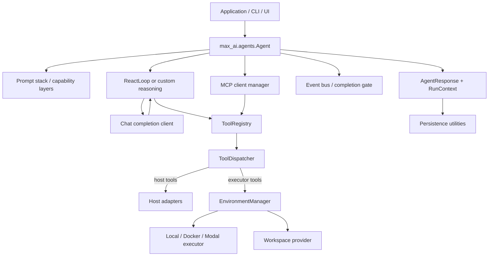

# Max AI Framework Architecture

This document maps the current `max_ai` Python package as implemented in this repository. The public agent runtime is `max_ai.agents.Agent`, exported by `max_ai.agents`. A separate, older `Agent` remains in `max_ai.base.agent`; it is not the runtime used by the examples or current documentation.

## Runtime at a glance



The `Agent` composes the runtime. It creates a tool registry and dispatcher, selects defaults for workspace, executor, and reasoning, binds the reasoning loop to the run dependencies, and builds prompt layers for the configured capabilities.

## A run's lifecycle

1. The application calls `Agent.run()`, a streaming method, or the event streaming method with input and optional run context.
2. The agent opens configured MCP connections, discovers available tools, and registers them for the current run. MCP tools remain distinct from the caller's `toolset`.
3. The agent prepares workspace and optional capability context, then renders the prompt stack and invokes the configured model client through the reasoning loop.
4. Model tool calls pass through `ToolDispatcher`. It validates the call, checks approval state, then invokes host adapters directly or provisions the managed environment and selected executor.
5. Tool results and model events return to the loop. The run continues until the loop or completion gate produces a terminal or paused outcome.
6. The agent returns an `AgentResponse` containing the `RunContext`, usage, finish reason, completion decision, final message/text accessors, and approval state. Managed sessions and MCP connections are closed according to their lifecycle.

## Package map

| Package | Responsibility |
| --- | --- |
| `max_ai/agents` | Public orchestration entry point, component composition, and run lifecycle. |
| `max_ai/base` | Contracts for clients, tools, reasoning, workspace, executor, registries, layers, middleware, completion, and compaction; also contains the older `base.Agent`. |
| `max_ai/core` | Runtime building blocks: messages, events, tool registry/dispatch, environments, process execution, middleware chain, prompt stack, cancellation, model schemas, and compaction accounting. |
| `max_ai/types` | Pydantic models for responses, run context, message history, completions, tool calls, and runtime state. |
| `max_ai/errors` | Typed exceptions for clients, tools, MCP, context, capabilities, and runtime failures. |
| `max_ai/capabilities/clients` | Provider model clients: Ollama, OpenAI, and OpenRouter. |
| `max_ai/capabilities/reasoning` | Reasoning implementations and guards; `react` contains the default `ReactLoop`. |
| `max_ai/capabilities/tools` | Function decorator/adapters, filesystem, Bash, plan, user-input, and Agent-as-tool integrations. |
| `max_ai/capabilities/executor` | Local, Docker, and Modal execution providers. |
| `max_ai/capabilities/workspace` | Workspace providers; local disk implementation is under `workspace/local`. |
| `max_ai/capabilities/memory` | Memory registries with local, MongoDB, and SQLite backends. |
| `max_ai/capabilities/knowledge` | Retrieval registries with local and MongoDB backends. |
| `max_ai/capabilities/skills` | Skill registries and metadata/resource loading. |
| `max_ai/capabilities/context` | Local and SQLite context registries; these are provider packages but are not a constructor input on the current public Agent. |
| `max_ai/capabilities/session_store`, `quota_store` | Session and quota storage adapters. |
| `max_ai/capabilities/stacks` | Prompt layers for policy, task analysis, rendering, skills, knowledge, memory, and session state. |
| `max_ai/capabilities/completion_gate` | Built-in runtime checks for plans, Bash outputs, and unresolved command failures. |
| `max_ai/capabilities/compaction` | Optional window and summary strategies for long conversations. |
| `max_ai/capabilities/mcp` | MCP config models, client manager, transports, tool adapters, and serialization helpers. |
| `max_ai/capabilities/middleware` | Logging, budget, and tracing middleware implementations. |
| `max_ai/core/embeddings` | Lightweight embedding helpers used by retrieval workflows. |
| `max_ai/loggers` | Framework logging setup and scoped logger helpers. |
| `max_ai/cli` | Textual terminal interface. |
| `website` | Flask-hosted static documentation site, separate from the agent runtime. |

The public `Agent` constructor groups its accepted values by responsibility:

| Group | Parameters | Meaning |
| --- | --- | --- |
| Required identity | `name`, `description`, `instructions` | Agent identity and behavioral instructions. |
| Required model | `client` | A `CoreChatCompletionClient` implementation. |
| Local Python tools | `toolset` | Sequence of `CoreTool` instances or callables. |
| MCP connections | `mcp` | Sequence of `MCPServerConfig`, separate from local Python `toolset`. |
| Execution | `executor`, `workspace` | Executor and workspace providers; defaults are local implementations. Idle timeout comes from framework settings. |
| Optional capabilities | `skills`, `memory`, `knowledge` | Registries that add prompt context and, where applicable, tools. Context registries exist but are not wired into this Agent constructor. |
| Run policy | `reasoning`, `output_format`, `completion`, `completion_handlers` | Reasoning strategy, structured response schema, runtime gate options, and application completion handlers. |
| Run controls | `compaction`, `middlewares` | Optional conversation compaction strategy and middleware hooks. |

When omitted, the agent uses `ReactLoop`, `LocalExecutor`, and `LocalWorkspace`. The iteration limit and executor-session idle timeout come from `max_ai.config.setting` (environment variables `MAX_LOOP_ITERATIONS` and `ENVIRONMENT_IDLE_TIMEOUT`). The default prompt stack includes policy, task analysis, rendering, and session state. Skills, knowledge, and memory layers are added only when their matching registries are supplied. The agent registers built-in filesystem, plan, and Bash tools unless the supplied toolset already uses those names; the ask-user tool is enabled by the reasoning configuration.

### Prompt construction and injection

For each run, `Agent._prompt_variables()` collects agent identity and the data needed by configured registries. `Agent._prompts()` renders every layer in stack order and stores the results in a `PromptCtx`:

```text
Agent fields + optional registry data
                │
                ▼
      Jinja2 CoreLayer templates
                │
                ▼
 PromptCtx.rendered_layers[layer type]
                │
                ▼
      client.run(ctx, prompts, tools)
                │
                ▼
 client.format_messages() → provider API
```

The current `max_ai.agents.Agent` builds this stack in `_build_prompt_stack()` in this order:

1. `AgentPolicyLayer` — uses `name`, `description`, and `instructions` from the agent constructor.
2. `TaskAnalysisLayer` — static task analysis guidance.
3. `RenderingLayer` — static output formatting guidance.
4. `SkillsLayer` — included when a skills registry is supplied; receives `loaded_skills` loaded during `prepare()`.
5. `KnowledgeLayer` — included when knowledge registries are supplied; receives their retrieval tool names.
6. `MemoryLayer` — included when a memory registry is supplied; receives the memory snapshot and available memory tool names scoped to the current user/session.
7. `SessionStateLayer` — always included; carries the current plan and compaction summary so they survive transcript compaction.

Each layer receives the run variables and renders its own template. `CoreLayer` uses Jinja2 and validates its placeholder contract when constructed. `PromptCtx` keeps the source `LayerContainer`, input variables, and the rendered strings keyed by concrete layer type. The client then decides how to turn those strings into provider-native messages. Ollama concatenates non-empty layers with blank lines into a system message, followed by message history and current messages; other providers can assemble their request differently.

Tool schemas are passed to `client.run()` separately from `PromptCtx`. The task and conversation history are also sent as `RunContext` messages, rather than being folded into a prompt layer. This separation lets prompt instructions, callable tools, and the conversation remain distinct inputs to the client.

`CoreLayer` subclasses can use inline templates or template files. The generic `build_default_stack(overrides=...)` helper can replace default layers for code using that API. The current public `max_ai.agents.Agent` constructs its stack internally and does not expose a custom `prompt_layers` constructor argument.

Capability providers generally follow a small package structure: `_model.py` contains the provider's Pydantic config model, while a separate module contains the implementation (for example, `memory/local/_model.py` and `memory/local/_registry.py`). Public `__init__.py` files expose the supported imports.

## Tools and execution boundaries

The `ToolRegistry` holds callable tool contracts and metadata. `ToolDispatcher` owns validation, approval handling, and invocation. Host tools execute inside the framework process; executor tools are routed through `EnvironmentManager` to the selected `ExecutorBase` implementation. This lets the agent combine framework controls and integrations with tools that run in a managed execution environment.

The agent currently adds filesystem and control tools as host-side tools and Bash as an executor-routed tool. User tools can be passed through `toolset`; MCP, memory, and knowledge tools are registered through their own integration paths.

## Capabilities and prompt composition

Memory, skills, and knowledge are optional constructor inputs. The agent includes corresponding prompt layers only when those capabilities are configured. Policy, task analysis, and rendering layers are part of the standard prompt stack. Workspace is a separate provider used for user files and materialization; executor is a separate provider responsible for running executor-routed tools.

Common implementation/config pairs include:

- `capabilities/memory/local/_model.py` and `_registry.py`
- `capabilities/knowledge/local/_model.py` and `_registry.py`
- `capabilities/skills/local/_model.py` and `_registry.py`
- `capabilities/workspace/local/_model.py` and `_workspace.py`
- `capabilities/executor/local/_model.py` and `_executor.py`
- `capabilities/clients/ollama/_model.py` and `client.py`

## MCP: multiple servers and serializable configuration

The agent accepts `mcp` as a sequence of server configuration models. MCP is configured separately from `toolset`, so local Python tools and tools discovered from MCP servers have distinct configuration and lifecycle.

`StdioMCPServerConfig` describes a process launched over stdio. `HTTPServerConfig` describes SSE or streamable HTTP connections. The models are Pydantic models and the package exports `serialize_mcp_servers()` and `deserialize_mcp_servers()` for JSON round trips. Treat credentials in config (such as HTTP tokens or headers) as secrets when persisting or sharing serialized payloads.

```python
from max_ai.agents import Agent
from max_ai.capabilities.mcp import (
    StdioMCPServerConfig,
    serialize_mcp_servers,
    deserialize_mcp_servers,
)

servers = [
    StdioMCPServerConfig(
        server_id="docs",
        command="python",
        args=["-m", "my_docs_mcp"],
    ),
]
payload = serialize_mcp_servers(servers)
restored_servers = deserialize_mcp_servers(payload)

agent = Agent(
    name="assistant",
    description="An assistant with MCP integrations",
    instructions="Use available tools when they help.",
    client=client,  # a CoreChatCompletionClient implementation
    mcp=restored_servers,
)
```

The project currently declares the Python MCP SDK dependency as `mcp>=2.0,<3` in `pyproject.toml`.

## Model clients and application interfaces

Model clients implement the shared client contract and translate framework messages, tool definitions, streaming chunks, and usage into provider-specific requests. Their configuration models are kept alongside each implementation. The documented package imports are under `max_ai.capabilities.clients`.

The same agent runtime can be integrated into the Textual CLI or an application built by the developer. Runtime events support streamed updates, approvals, and additional user input. `AgentResponse` represents completed and paused runs, and `RunContext` is a Pydantic model that applications can serialize and store using their chosen persistence layer. The repository does not include a `max_ai.persistence` or `max_ai.ui` package.

## Main implementation references

- `max_ai/agents/agent.py` — agent composition and orchestration.
- `max_ai/core/tool/registry.py` and `dispatcher.py` — tool registration and dispatch.
- `max_ai/core/environment/manager.py` — managed execution sessions.
- `max_ai/capabilities/reasoning/react/loop.py` — default reasoning loop.
- `max_ai/capabilities/mcp/_model.py` — MCP config types and JSON helpers.
- `max_ai/types/agent_response.py` — public run result.
